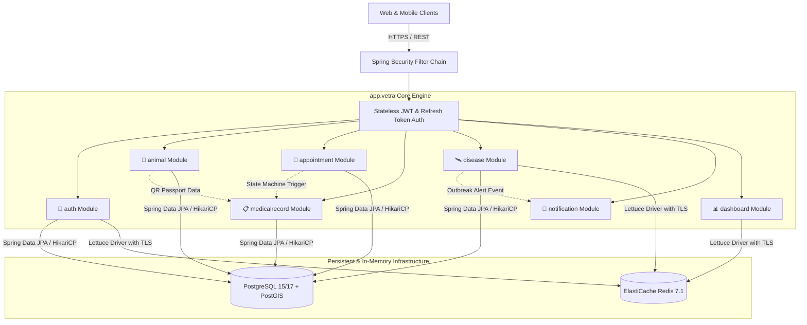
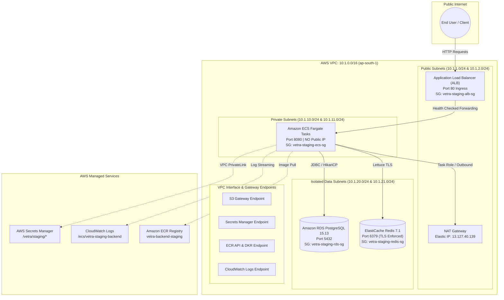
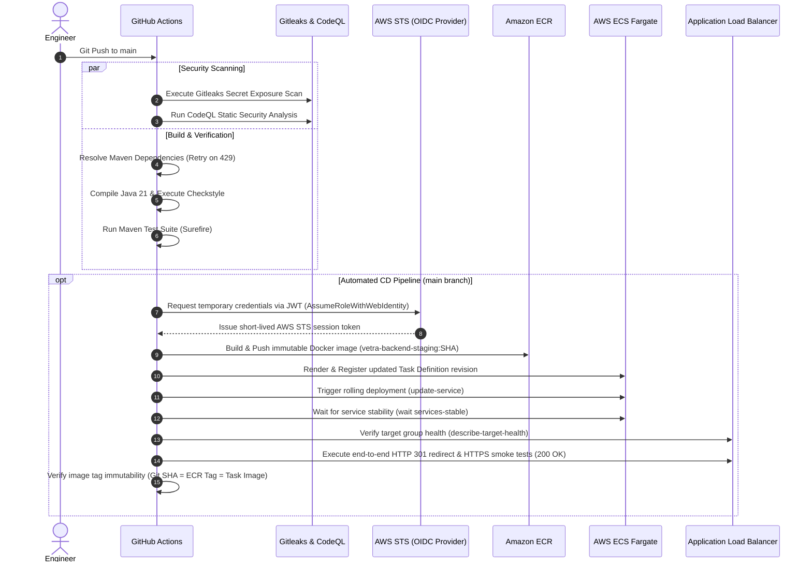
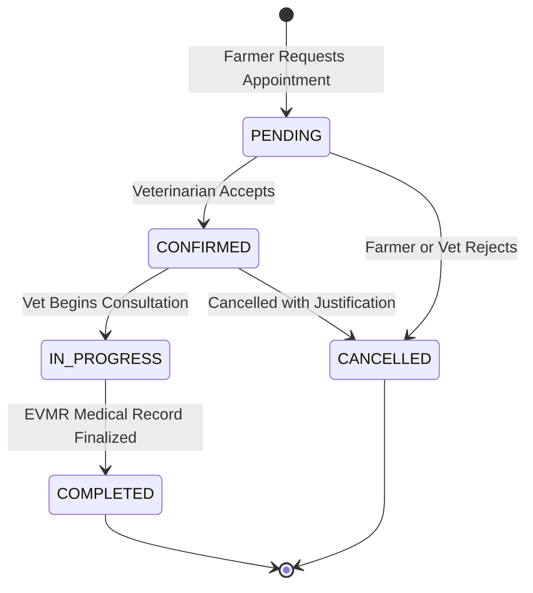

<div align="center">

# 🐾 Vetra Backend
### Enterprise Veterinary Operating System (VetOS) & Clinical Core Engine

[](https://github.com/omrajput14/vetra-backend/actions/workflows/ci.yml)
[](https://github.com/omrajput14/vetra-backend/actions/workflows/codeql.yml)
[](https://www.oracle.com/java/technologies/downloads/#java21)
[](https://spring.io/projects/spring-boot)
[](https://www.postgresql.org/)
[](https://redis.io/)
[](https://www.docker.com/)
[](https://aws.amazon.com/ecs/)
[](https://www.terraform.io/)
[](https://flywaydb.org/)
[](LICENSE)

<p align="center">
  <b>Production-grade, modular monolith REST API powering livestock health tracking, clinical veterinary workflows, epidemiological disease surveillance, and tamper-proof digital animal passports.</b>
</p>

<p align="center">
  <a href="#-system-architecture">Architecture</a> •
  <a href="#-aws-cloud-deployment">AWS Cloud Infrastructure</a> •
  <a href="#-key-capabilities">Core Domains</a> •
  <a href="#-rest-api-overview">API Reference</a> •
  <a href="#-security-and-compliance">Security</a> •
  <a href="#-database--migrations">Flyway Migrations</a> •
  <a href="#-quick-start-local-development">Quick Start</a> •
  <a href="#-documentation-index">Documentation</a>
</p>

</div>

---

## 📌 Executive Summary

**Vetra** is an enterprise Veterinary Operating System (VetOS) built to modernize livestock healthcare management, veterinary practice operations, and regional disease outbreak intelligence. 

Engineered with **Java 21 LTS** and **Spring Boot 3.5**, Vetra adopts a **Domain-Driven Modular Monolith** architecture backed by **PostgreSQL with PostGIS** spatial indexing and **Redis 7 with in-transit TLS encryption**. The platform is containerized with multi-stage Docker builds and deployed to **AWS** via **Terraform** on **Amazon ECS Fargate** behind an **Application Load Balancer (ALB)** with zero-plaintext runtime secret injection via **AWS Secrets Manager**.

---

## 🏛 System Architecture

Vetra is structured as a cohesive **Modular Monolith** applying **Clean Architecture** and **Domain-Driven Design (DDD)** boundaries within a single deployable artifact.



### Architectural Rationale
* **High Domain Cohesion:** Strictly partitioned packages (`auth`, `animal`, `appointment`, `medicalrecord`, `disease`, `notification`, `dashboard`, `infrastructure`) preserve separation of concerns.
* **Transaction Integrity:** ACID guarantees across complex clinical transactions (e.g. appointment state transition + medical record creation) without distributed transaction overhead (2PC/Saga).
* **Operational Efficiency:** Single-pipeline builds, low-overhead container execution, and simple local reproducibility while remaining decoupled for future microservice extraction if required.

---

## ☁️ AWS Cloud Deployment

The staging environment is fully provisioned using **Terraform (IaC)** in AWS Region `ap-south-1` (Mumbai) across multiple Availability Zones with multi-tier network isolation.



### Network Security & Traffic Model
1. **Public Ingress:** ALB in public subnets is the **sole entry point** (`vetra-staging-alb-sg`).
2. **Compute Isolation:** ECS Fargate tasks reside in **private subnets** with **no public IPs** (`vetra-staging-ecs-sg`).
3. **Data Isolation:** RDS and ElastiCache reside in **isolated subnets** with zero internet ingress/egress.
4. **Security Group Chaining:** `ALB:80` → `ECS:8080` → `RDS:5432` & `Redis:6379`.
5. **Runtime Secret Injection:** Passwords and keys (`DB_PASSWORD`, `REDIS_PASSWORD`, `JWT_SECRET`) are injected dynamically via Secrets Manager ARNs into the container at startup.

---

## ⚡ Verified Staging Infrastructure Catalog

| Resource / Layer | AWS Service | Specification / Configuration | Live Verification Status |
|---|---|---|---|
| **VPC** | AWS VPC | `10.1.0.0/16` across `ap-south-1a` and `ap-south-1b` | 🟢 **ACTIVE** |
| **Public Subnets** | AWS Subnet | `10.1.1.0/24`, `10.1.2.0/24` (ALB placement) | 🟢 **ACTIVE** |
| **Private Subnets** | AWS Subnet | `10.1.10.0/24`, `10.1.11.0/24` (ECS Fargate compute) | 🟢 **ACTIVE** |
| **Isolated Subnets** | AWS Subnet | `10.1.20.0/24`, `10.1.21.0/24` (RDS & ElastiCache) | 🟢 **ACTIVE** |
| **Internet Gateway** | AWS IGW | Public routing for ALB ingress | 🟢 **ACTIVE** |
| **NAT Gateway** | AWS NAT GW | Outbound egress for private subnets | 🟢 **ACTIVE** |
| **Relational Database** | Amazon RDS | PostgreSQL 15.13 (`db.t4g.micro`, 20GB gp3, PostGIS) | 🟢 **ACTIVE** |
| **In-Memory Cache** | Amazon ElastiCache | Redis 7.1 (`cache.t4g.micro`, in-transit TLS enabled) | 🟢 **ACTIVE** |
| **Container Registry** | Amazon ECR | `vetra-backend-staging` (Scan-on-push, lifecycle rules) | 🟢 **ACTIVE** |
| **Secret Management** | AWS Secrets Manager | Encrypted storage for DB, Redis, and JWT signing keys | 🟢 **ACTIVE** |
| **Compute Engine** | Amazon ECS | Fargate Cluster (`vetra-staging-cluster`) | 🟢 **ACTIVE** |
| **ECS Service** | Amazon ECS | `vetra-staging-backend-service` (Desired: 1, Running: 1) | 🟢 **ACTIVE** |
| **Load Balancer** | AWS ALB | `vetra-staging-alb` with health-checked target group | 🟢 **ACTIVE** |
| **Observability** | AWS CloudWatch | Container logs under `/ecs/vetra-staging-backend` | 🟢 **ACTIVE** |
| **IAM & OIDC** | AWS IAM | Keyless GitHub Actions deploy role & ECS task roles | 🟢 **ACTIVE** |

---

## 🔄 CI/CD & Automated Continuous Deployment Pipeline

Vetra utilizes a secure, fully automated continuous integration and continuous deployment (CI/CD) pipeline powered by **GitHub Actions** and **AWS IAM OIDC**:



### Pipeline Guarantees & Security
* **Keyless OIDC Authentication:** No long-lived AWS Access Keys or Secret Keys are stored in GitHub Secrets. Authentication occurs dynamically via GitHub's OpenID Connect identity token verified against AWS STS.
* **Immutable Commit SHA Tagging:** Container images are uniquely tagged with the full Git commit SHA (`vetra-backend-staging:<sha>`) rather than mutable tags like `latest`.
* **Zero Plaintext Secrets:** Task definition updates preserve dynamic AWS Secrets Manager ARNs (`DB_PASSWORD`, `REDIS_PASSWORD`, `JWT_SECRET`) without embedding credentials.
* **Automated Health & Stability Gates:** The deployment workflow blocks and fails if ECS fails to reach steady state, if the ALB target group reports unhealthy, if HTTP 80 fails to redirect (301) to HTTPS, or if any of the deep HTTPS health probes fail (`/actuator/health/liveness`, `/actuator/health`, `/liveness`, `/readiness`).
* **Deployment Circuit Breaker:** ECS rolling deployments utilize automatic circuit breakers with rollback to prevent bad deployments from persisting.


---

## 🎯 Key Capabilities & Domain Workflows

### 1. Dual-Role Authentication & Access Control (RBAC)
* Strict domain separation between **FARMER** and **VETERINARIAN** roles.
* Stateless session tokens via HMAC-SHA256 JWTs with 24-hour expiration.
* Database-backed refresh token rotation with single-use revocation to mitigate replay attacks.

### 2. Digital Livestock Passport
* Tamper-proof animal identification bound to unique QR code IDs (`qr_code_id`).
* Full lifecycle tracking (species, breed, date of birth, tag IDs, ownership transfers).
* Instant chronological medical history accessible via QR code scans in the field.

### 3. Clinical Appointment State Machine


### 4. Electronic Veterinary Medical Records (EVMR)
* Immutable medical records authored by licensed veterinarians.
* Captures symptoms, diagnostic notes, vital signs, administered prescriptions, and clinical follow-up directives.
* Strict authorization: Only the attending licensed veterinarian can seal a record.

### 5. Epidemiological Disease Surveillance & Outbreak Intelligence
* Real-time disease reporting with severity scoring and clinical metadata.
* **PostGIS Spatial Queries:** Radius-based cluster analysis (`ST_DWithin`) to detect disease outbreak velocity.
* Automated high-risk zone geofencing and broadcast alert dispatching.

---

## 📡 REST API Overview & Endpoints

| Method | Endpoint | Access Level | Description |
|---|---|---|---|
| `POST` | `/api/v1/auth/register` | Public | Register Farmer or Veterinarian account |
| `POST` | `/api/v1/auth/login` | Public | Authenticate user & issue JWT + Refresh Token |
| `POST` | `/api/v1/auth/refresh` | Public | Rotate refresh token & issue new JWT |
| `GET` | `/api/v1/animals` | Authenticated | List animals registered under farmer profile |
| `POST` | `/api/v1/animals` | `ROLE_FARMER` | Register new livestock with unique QR identifier |
| `GET` | `/api/v1/animals/qr/{qrCodeId}` | Authenticated | Retrieve digital animal passport by QR code |
| `POST` | `/api/v1/appointments` | `ROLE_FARMER` | Request clinical veterinary appointment |
| `PATCH` | `/api/v1/appointments/{id}/status` | `ROLE_VETERINARIAN` | Transition appointment state |
| `POST` | `/api/v1/medical-records` | `ROLE_VETERINARIAN` | Create immutable EVMR medical record |
| `POST` | `/api/v1/disease-reports` | Authenticated | Submit regional livestock disease report |
| `GET` | `/api/v1/dashboard` | Authenticated | Retrieve role-specific metrics & schedules |
| `GET` | `/actuator/health` | Public | Full infrastructure health probe |

*Interactive API documentation is accessible via Swagger UI at `/swagger-ui.html`.*

---

## 🛡️ Security & Compliance

```
┌────────────────────────────────────────────────────────────────────────┐
│                        DEFENSE IN DEPTH MATRIX                         │
├────────────────────────┬───────────────────────────────────────────────┤
│ Identity Layer         │ JWT HMAC-SHA256, Refresh Token Rotation, RBAC │
├────────────────────────┼───────────────────────────────────────────────┤
│ Secret Management      │ AWS Secrets Manager dynamic ARN injection     │
├────────────────────────┼───────────────────────────────────────────────┤
│ Network Perimeter      │ ALB public entry, private ECS subnets, no IP  │
├────────────────────────┼───────────────────────────────────────────────┤
│ Data Tier Isolation    │ Isolated subnets, RDS & Redis unexposed       │
├────────────────────────┼───────────────────────────────────────────────┤
│ Data in Transit        │ HTTPS (ALB) & TLS-encrypted Redis connection  │
├────────────────────────┼───────────────────────────────────────────────┤
│ Container Security     │ Alpine JRE, Non-root `vetra:vetra` user       │
├────────────────────────┼───────────────────────────────────────────────┤
│ CI/CD Authentication   │ Keyless GitHub OIDC with least-privilege IAM  │
├────────────────────────┼───────────────────────────────────────────────┤
│ Static & Secret Audits │ Gitleaks secret scanner, GitHub CodeQL SAST   │
└────────────────────────┴───────────────────────────────────────────────┘
```

---

## 🗄 Database & Migrations

Database evolution is managed via **Flyway** with 14 version-controlled, production-validated SQL migrations:

```
src/main/resources/db/migration/
├── V1__baseline.sql                                 ← Schema baseline & UUID extensions
├── V2__schema_entities.sql                          ← Users, roles, and core entity tables
├── V3__refresh_tokens.sql                           ← Refresh token rotation storage
├── V4__add_animal_name.sql                          ← Animal naming enhancements
├── V5__create_appointments.sql                      ← Appointment state machine schema
├── V6__create_medical_records.sql                   ← Immutable EVMR record tables
├── V7__optimize_vet_availability_index.sql          ← Performance indexing for vet schedules
├── V8__create_ai_scan_tables.sql                    ← AI diagnostic scan metadata
├── V9__create_ai_scan_results.sql                   ← AI diagnostic structured results
├── V10__make_medical_records_appointment_optional.sql← Walk-in consultation support
├── V11__create_disease_surveillance.sql             ← Disease reporting & PostGIS spatial schema
├── V12__outbreak_intelligence_engine.sql            ← Outbreak clustering & trigger procedures
├── V13__disease_intelligence_automation.sql         ← Automated alert generation schema
└── V14__notification_engine.sql                     ← Multi-channel notification templates & logs
```

---

## 📊 Health & Observability

### Verified Staging Health Probe Matrix

| Probe Endpoint | Protocol | HTTP Status | Response Payload | Verification State |
|---|---|---|---|---|
| `/actuator/health/liveness` | HTTP GET | `200 OK` | `{"status":"UP"}` | 🟢 Verified Live |
| `/actuator/health/readiness` | HTTP GET | `200 OK` | `{"status":"UP"}` | 🟢 Verified Live (DB + Disk) |
| `/actuator/health` | HTTP GET | `200 OK` | `{"status":"UP","groups":["liveness","readiness"]}` | 🟢 Verified Live (PostgreSQL + Redis TLS) |
| `/liveness` | HTTP GET | `200 OK` | `{"success":true,"status":200,"message":"Application is alive"}` | 🟢 Verified Live |
| `/readiness` | HTTP GET | `200 OK` | `{"success":true,"status":200,"message":"Application is ready"}` | 🟢 Verified Live |

### Structured Logging & Diagnostics
* Logs stream to Amazon CloudWatch under log group `/ecs/vetra-staging-backend`.
* Spring Boot logs format with MDC correlation IDs:
  ```text
  2026-08-14 17:54:31.155 [http-nio-8080-exec-2] [traceId=4d430681b7b02767c53d3fc3c64ef3fa] [spanId=e9c9aecdea0bf1da] [11dce0a6-9727-47e3-a2c7-43ad07d692a3] INFO a.v.i.logging.LoggingFilter - method=GET uri=/actuator/health/liveness status=200 duration=400ms
  ```

### CloudWatch Observability & Alerting (Stage 14.10)
* **Unified Operations Dashboard:** `vetra-staging-operations-dashboard` tracking ECS compute, ALB latency (p50/p95), HTTP error rates, target group health, RDS connections/storage, Redis Engine CPU/memory, and application log metrics.
* **Proactive Alarms:** 12 automated CloudWatch metric alarms for compute, networking, data tier, and container error spikes routing to `vetra-staging-alerts-topic`.
* **Log Metric Filters:** Real-time log scanning for application `ERROR` spikes and HikariCP connection pool timeouts.
* **Operations Manual:** See [AWS CloudWatch Observability Manual](docs/operations/cloudwatch-monitoring.md) for alarm catalogs, thresholds, and runbooks.

---

## 🚀 Quick Start (Local Development)

### 1. Prerequisites
* **Java 21 LTS** (Eclipse Temurin recommended)
* **Docker Desktop** (for PostgreSQL 17 + PostGIS and Redis 7)
* **Maven 3.9+** (or use included `./mvnw` wrapper)

### 2. Clone and Setup Environment
```bash
git clone https://github.com/omrajput14/vetra-backend.git
cd vetra-backend
cp .env.example .env
```

### 3. Start Local Database & Cache Containers
```bash
docker compose up -d postgres redis
```

### 4. Build and Run Application
```bash
./mvnw clean spring-boot:run
```

### 5. Verify Running Services
* **Health Endpoint:** `curl http://localhost:8080/actuator/health` → `{"status":"UP"}`
* **Interactive Swagger UI:** Open `http://localhost:8080/swagger-ui.html`

### 6. Code Formatting & Quality Checks
```bash
# Verify Google Java Format compliance
./mvnw spotless:check

# Auto-format codebase
./mvnw spotless:apply

# Execute Checkstyle rules
./mvnw checkstyle:check

# Run full test suite
./mvnw test
```

---

## 📚 Documentation Index

Comprehensive engineering specifications and architecture design records are maintained under `docs/`:

### 🏛 Architecture & Product
* [Engineering Principles](docs/engineering/00-principles.md) — *The Vetra Engineering Constitution*
* [Product Requirements Document (PRD v2.0.0)](docs/product/01-PRD.md)
* [Software Architecture Document (SAD v2.0.0)](docs/architecture/02-SAD.md)
* [Modular Monolith Architecture](docs/architecture/08-modular-monolith.md)
* [Deployment Architecture](docs/architecture/09-deployment.md)
* [Infrastructure Diagram](docs/architecture/10-infrastructure.md)
* [Architecture Decision Log](docs/domain/21-decision-log.md)

### 📊 Domain & Database
* [Domain Model & Ubiquitous Language](docs/domain/03-domain-model.md)
* [Database Design Document](docs/database/04-database-design.md)
* [Entity Relationship Diagram (ERD)](docs/database/05-ERD.md)

### 🔌 API & Security
* [API Specification (REST Endpoints)](docs/api/06-specification.md)
* [Authentication & Authorization Design](docs/api/07-auth-design.md)
* [API Versioning Strategy](docs/api/22-versioning.md)
* [Application Error Catalogue](docs/api/23-error-catalogue.md)
* [Security Design Document](docs/security/11-security-design.md)
* [AWS Security Architecture](docs/operations/aws-security.md)

### 🛠 Operations & Engineering Guides
* [Developer Onboarding Guide](docs/guides/20-developer-onboarding.md)
* [Continuous Deployment & Verification Manual](docs/operations/cicd-deployment.md)
* [Production Infrastructure & HA Manual](docs/operations/production-infrastructure.md)
* [AWS CloudWatch Observability Manual](docs/operations/cloudwatch-monitoring.md)
* [ECS Application Auto Scaling Manual](docs/operations/autoscaling.md)
* [Enterprise Caching Architecture](docs/architecture/25-caching-architecture.md)
* [Cache Performance Benchmark Report](docs/performance/cache-benchmark-report.md)
* [Coding Standards & Conventions](docs/engineering/12-coding-standards.md)
* [Git Workflow & Branching Strategy](docs/engineering/13-git-workflow.md)
* [Testing Strategy](docs/guides/14-testing-strategy.md)
* [CI/CD Pipeline Specification](docs/operations/15-cicd.md)
* [Logging & Monitoring Strategy](docs/operations/16-logging-monitoring.md)
* [Disaster Recovery & Backup Plan](docs/operations/17-disaster-recovery.md)
* [Scalability & Performance Plan](docs/operations/18-scalability.md)
* [Environment Configuration](docs/operations/24-environment-config.md)

---

## 🔮 Roadmap & Upcoming Milestones

* [x] **Stage 14.8:** AWS ACM SSL/TLS certificate provisioning on `api.vetra.dpdns.org` with HTTPS Port 443 listener (`ELBSecurityPolicy-TLS13-1-2-2021-06`) and automated HTTP 80 → 443 redirect.
* [x] **Stage 14.9:** Automated continuous deployment pipeline with GitHub Actions, keyless OIDC, task definition registration, ECS service rolling update, stability gates, target health checks, and smoke tests.
* [x] **Stage 14.10:** AWS CloudWatch Observability & Monitoring suite: operational telemetry dashboard, 12 metric alarms (ECS, ALB, RDS, Redis), log metric filters, and SNS alert notifications.
* [x] **Stage 14.11:** AWS Application Auto Scaling with dual target-tracking policies (CPU @ 70%, ALB requests @ 1000 req/target), multi-AZ Fargate task balancing (1–3 tasks), and cooldown safeguards.
* [ ] **Stage 14.12:** Production infrastructure parity & High-Availability specification (3-AZ VPC, Multi-AZ RDS, ElastiCache cluster, ECS auto-scaling, CloudWatch suite). *(Apply Pending Review)*


---

## 📄 License

This project is licensed under the MIT License — see the [LICENSE](LICENSE) file for details.
