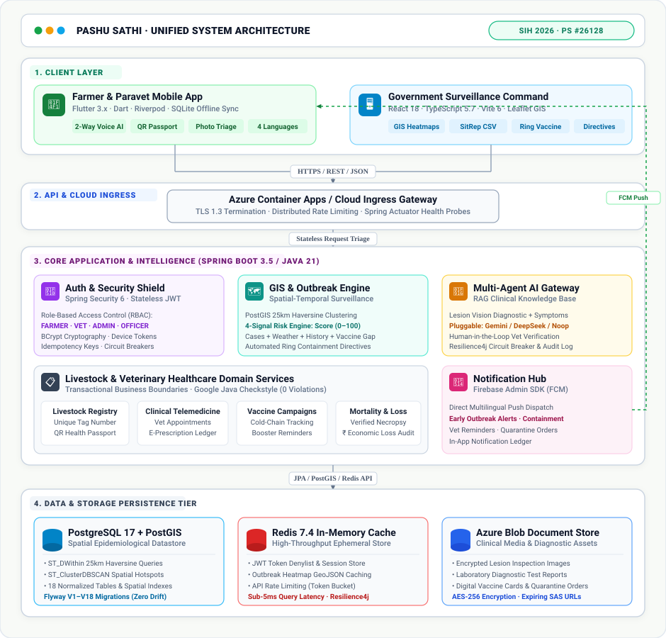
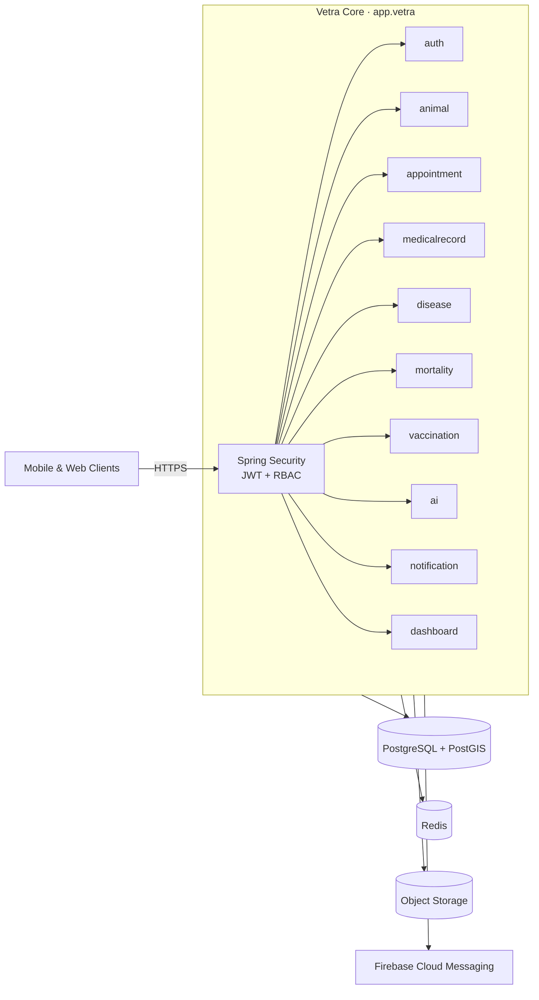
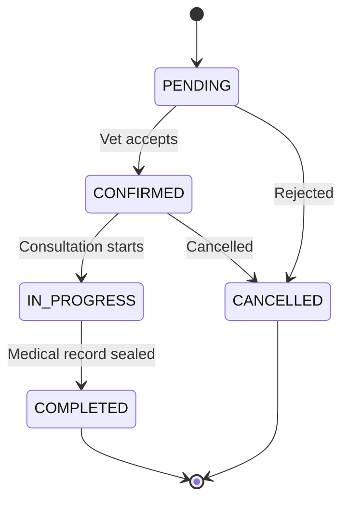

<div align="center">

# VETRA

### Veterinary Operating System — Backend Platform

*Livestock health, clinical workflows, disease surveillance and digital animal passports on a single, secure API.*

<br/>

[](https://github.com/omrajput14/vetra-backend/actions/workflows/ci.yml)
[](https://github.com/omrajput14/vetra-backend/actions/workflows/codeql.yml)


[Overview](#overview) ·
[Architecture](#architecture) ·
[Features](#features) ·
[Tech Stack](#tech-stack) ·
[Getting Started](#getting-started) ·
[API](#api) ·
[Security](#security) ·
[Deployment](#deployment) ·
[Documentation](#documentation)

</div>

---

## Overview

Vetra connects **farmers**, **veterinarians**, **para-vets** and **government health officers** on one platform. It replaces paper records and fragmented communication with:

- a **digital passport** for every animal, reachable by QR code,
- an end-to-end **clinical workflow** from appointment to sealed medical record,
- **AI-assisted diagnosis** with para-vet and veterinarian review,
- **geospatial disease surveillance** that detects and escalates outbreaks early.

The backend is a **modular monolith** built with Java 21 and Spring Boot 3.5. It follows Domain-Driven Design boundaries, which keeps transactions simple today and leaves a clear path to service extraction later.

---

## Architecture




```mermaid
graph LR
    Client["Mobile & Web Clients"] -->|HTTPS| API["Spring Security<br/>JWT + RBAC"]

    subgraph Core ["Vetra Core · app.vetra"]
        API --> auth & animal & appointment & medicalrecord
        API --> disease & mortality & vaccination
        API --> ai & notification & dashboard
    end

    Core --> PG[("PostgreSQL + PostGIS")]
    Core --> RD[("Redis")]
    Core --> S3[("Object Storage")]
    Core --> FCM["Firebase Cloud Messaging"]
```

**Design principles**

| Principle | In practice |
|---|---|
| Domain cohesion | One package per bounded context under `app.vetra` |
| Transactional integrity | ACID across clinical flows — no distributed transactions |
| Operational simplicity | A single deployable artifact, reproducible locally with Docker Compose |
| Resilience | Redis cache degrades gracefully to the database; Resilience4j guards external calls |

---

## Features

| Domain | Capabilities |
|---|---|
| **Identity & Access** | Farmer, veterinarian, para-vet and officer roles; short-lived JWTs; single-use refresh-token rotation; vet verification workflow |
| **Animal Passport** | QR-bound identity, lifecycle and ownership history, photos, health records and vaccination history |
| **Appointments** | State machine `PENDING → CONFIRMED → IN_PROGRESS → COMPLETED`, vet availability and shifts, emergency requests, in-appointment chat |
| **Medical Records** | Immutable electronic veterinary medical records sealed by the attending veterinarian; prescriptions and follow-ups |
| **AI Diagnostics** | Scan analysis through a provider-agnostic gateway, RAG knowledge base, para-vet triage and approval of results |
| **Disease Surveillance** | Disease reporting, PostGIS radius clustering (`ST_DWithin`), multi-signal outbreak risk scoring, alert actions |
| **Mortality Tracking** | Animal mortality events with veterinarian validation, feeding into outbreak intelligence |
| **Vaccination Campaigns** | District-level drives, dose tracking and para-vet drive management |
| **Notifications** | In-app and push delivery, per-user preferences, device registration, localized messages |
| **Dashboards** | Role-specific metrics for farmers, vets and government users, cached in Redis |

Appointment lifecycle:


```mermaid
stateDiagram-v2
    [*] --> PENDING
    PENDING --> CONFIRMED: Vet accepts
    PENDING --> CANCELLED: Rejected
    CONFIRMED --> IN_PROGRESS: Consultation starts
    CONFIRMED --> CANCELLED: Cancelled
    IN_PROGRESS --> COMPLETED: Medical record sealed
    COMPLETED --> [*]
    CANCELLED --> [*]
```

---

## Tech Stack

| Layer | Technology |
|---|---|
| Language & framework | Java 21, Spring Boot 3.5 (Web, WebFlux, Security, Validation, Data JPA, Cache) |
| Data | PostgreSQL + PostGIS, Hibernate Spatial, Flyway (38 migrations) |
| Cache | Redis 7 with Lettuce (TLS in cloud environments) |
| Auth | JJWT (HMAC-SHA256), BCrypt |
| Resilience | Resilience4j |
| Observability | Actuator, Micrometer, Prometheus, Grafana, Tempo, Alertmanager, OpenTelemetry |
| Integrations | AWS S3 / STS, Firebase Admin (push) |
| API docs | springdoc OpenAPI / Swagger UI |
| Quality | Spotless (Google Java Format), Checkstyle, JUnit 5, H2 for tests, CodeQL, Gitleaks |
| Delivery | Docker multi-stage image, GitHub Actions, Terraform |

---

## Getting Started

### Prerequisites

- Java 21 (Eclipse Temurin recommended)
- Docker and Docker Compose
- Maven 3.9+ (or the bundled `./mvnw`)

### Run locally

```bash
git clone https://github.com/omrajput14/vetra-backend.git
cd vetra-backend

cp .env.example .env          # then fill in the required secrets
docker compose up -d postgres redis
./mvnw spring-boot:run
```

Verify it is running:

```bash
curl http://localhost:8080/actuator/health        # {"status":"UP"}
```

Swagger UI is available at `http://localhost:8080/swagger-ui.html`.

### Run the full stack in containers

```bash
docker compose up -d --build                       # API + Postgres + Redis + observability
docker compose -f docker-compose.yml -f docker-compose.dev.yml up -d   # adds Adminer for development
```

### Quality checks

```bash
./mvnw spotless:apply        # format
./mvnw checkstyle:check      # lint
./mvnw test                  # unit and integration tests
```

---

## API

All endpoints are versioned under `/api/v1`. Authenticate with `Authorization: Bearer <access-token>`.

| Area | Base path |
|---|---|
| Authentication | `/api/v1/auth`, `/api/v1/auth/paravet` |
| Users & profiles | `/api/v1/users` |
| Animals | `/api/v1/animals`, `/api/v1/animals/{id}/photo`, `/api/v1/animals/{animalId}/health-records` |
| Appointments | `/api/v1/appointments`, `/api/v1/appointments/{appointmentId}/messages` |
| Medical records | `/api/v1/medical-records` |
| AI scans | `/api/v1/ai/scans` |
| Disease surveillance | `/api/v1/disease`, `/api/v1/disease/reports`, `/api/v1/geo` |
| Workforce | `/api/v1/workforce` |
| Mortality | `/api/v1/mortalities` |
| Vaccination | `/api/v1/vaccination/campaigns`, `/api/v1/paravet/drives` |
| Notifications | `/api/v1/notifications`, `/preferences`, `/devices` |
| Dashboard | `/api/v1/dashboard` |
| System | `/api/v1/system`, `/actuator/health` |

The interactive reference is served at `/swagger-ui.html`; the written specification is in [`docs/api/06-specification.md`](docs/api/06-specification.md).

---

## Security

| Layer | Controls |
|---|---|
| Identity | Stateless JWT, refresh-token rotation with single-use revocation, role-based access control |
| Secrets | Injected at runtime from AWS Secrets Manager; nothing sensitive is committed (Gitleaks enforced in CI) |
| Network | Public load balancer only; compute in private subnets; data tier in isolated subnets |
| Transport | HTTPS at the load balancer (TLS 1.2+), TLS-encrypted Redis |
| Idempotency | Idempotency keys on mutating requests to prevent duplicate writes |
| Container | Minimal Alpine JRE image, non-root user |
| CI/CD | Keyless GitHub OIDC to AWS with least-privilege IAM; CodeQL static analysis |

Please report vulnerabilities privately to the maintainers rather than opening a public issue.

---

## Deployment

Vetra ships as a single container image and supports two deployment targets.

**AWS (staging and production)** — provisioned with Terraform in [`infra/`](infra/README.md): multi-AZ VPC, ECS Fargate behind an Application Load Balancer, RDS PostgreSQL, ElastiCache Redis, Secrets Manager, CloudWatch dashboards and alarms, and auto scaling.

**Single VM (Docker Compose)** — see [`DEPLOYMENT.md`](DEPLOYMENT.md).

The CI/CD pipeline (GitHub Actions) runs on every push:

1. Secret scan (Gitleaks) and static analysis (CodeQL)
2. Compile, Checkstyle, and the full test suite
3. On `main`: assume an AWS role via OIDC, build and push an image tagged with the commit SHA
4. Roll out to ECS with a circuit breaker, wait for stability, verify target health and run smoke tests

---

## Documentation

| Topic | Documents |
|---|---|
| Product & architecture | [PRD](docs/product/01-PRD.md) · [SAD](docs/architecture/02-SAD.md) · [Modular monolith](docs/architecture/08-modular-monolith.md) · [Decision log](docs/domain/21-decision-log.md) |
| Domain & data | [Domain model](docs/domain/03-domain-model.md) · [Database design](docs/database/04-database-design.md) · [ERD](docs/database/05-ERD.md) |
| API & security | [API specification](docs/api/06-specification.md) · [Auth design](docs/api/07-auth-design.md) · [Error catalogue](docs/api/23-error-catalogue.md) · [Security design](docs/security/11-security-design.md) |
| AI platform | [AI gateway](docs/architecture/ai-gateway.md) · [RAG platform](docs/architecture/ai-rag-platform.md) · [Governance](docs/architecture/ai-governance.md) · [Clinical triage](docs/architecture/clinical-triage.md) |
| Operations | [CI/CD](docs/operations/cicd-deployment.md) · [Production infrastructure](docs/operations/production-infrastructure.md) · [Monitoring](docs/operations/cloudwatch-monitoring.md) · [Auto scaling](docs/operations/autoscaling.md) · [Disaster recovery](docs/operations/17-disaster-recovery.md) |
| Engineering | [Principles](docs/engineering/00-principles.md) · [Coding standards](docs/engineering/12-coding-standards.md) · [Git workflow](docs/engineering/13-git-workflow.md) · [Testing strategy](docs/guides/14-testing-strategy.md) · [Onboarding](docs/guides/20-developer-onboarding.md) |

Release history is tracked in [`CHANGELOG.md`](CHANGELOG.md).

---

## Contributing

1. Branch from `main` following the [Git workflow](docs/engineering/13-git-workflow.md).
2. Run `./mvnw spotless:apply checkstyle:check test` before opening a pull request.
3. Keep changes focused and include tests for new behavior.

---

<div align="center">

**Vetra** — built for the people who keep livestock healthy.

</div>
