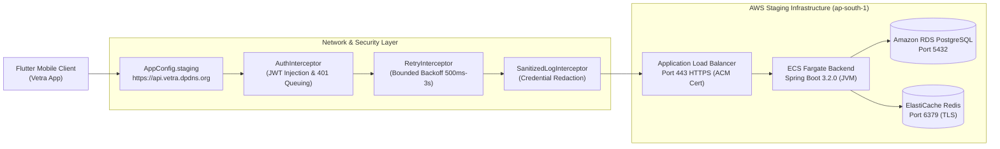
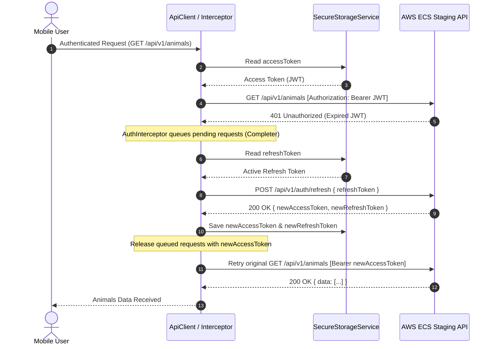
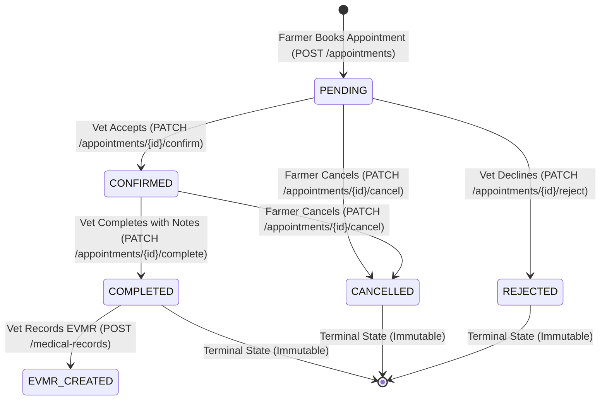

# Stage 15 — Mobile Client Live Staging Backend Integration & Contract Verification Manual

**Document ID:** API-15.01  
**Target Environment:** Staging (`https://api.vetra.dpdns.org`)  
**Client Framework:** Flutter 3.44.8 / Dart 3.12.2 (Dio HTTP Client)  
**Backend Framework:** Spring Boot 3.2.0 (AWS ECS Fargate Multi-AZ)  
**Status:** **VERIFIED** — Live Staging Integration & Contract Suite Passing  
**Last Updated:** August 2026  

---

## 1. Architectural Overview & Environment Routing

The Vetra Flutter mobile client communicates with the live AWS Staging infrastructure over secure HTTPS (TLS 1.3/1.2) terminated by the Application Load Balancer in region `ap-south-1`.



---

## 2. Environment Configuration Matrix

The client architecture provides strict separation of deployment environments via `AppConfig`:

| Environment | Base URL | API Prefix | Timeout (Connect/Receive/Send) | Default |
|---|---|---|---|---|
| **Development** | `http://localhost:8080` (or `http://10.0.2.2:8080` Android) | `/api/v1` | 15s / 15s / 15s | No |
| **Staging (Live AWS)** | `https://api.vetra.dpdns.org` | `/api/v1` | 15s / 15s / 15s | **Yes (Active)** |
| **Production** | `https://api.vetra.app` | `/api/v1` | 15s / 15s / 15s | No |

```dart
// Environment switching API
AppConfig.useStaging();     // Points to https://api.vetra.dpdns.org
AppConfig.useDevelopment(); // Points to localhost
AppConfig.useProduction();  // Points to https://api.vetra.app
```

---

## 3. Verified API Contract Matrix

Every endpoint listed below has been verified against the **live staging backend (`https://api.vetra.dpdns.org`)** using automated end-to-end integration tests:

| Module / Operation | HTTP Route | Method | Auth Required | Request Payload DTO | Response Payload DTO | Live Status |
|---|---|---|---|---|---|---|
| **Actuator Health** | `/actuator/health` | `GET` | Public | None | `{"status": "UP"}` | **VERIFIED** |
| **Liveness Probe** | `/actuator/health/liveness` | `GET` | Public | None | `{"status": "UP"}` | **VERIFIED** |
| **Readiness Probe** | `/actuator/health/readiness` | `GET` | Public | None | `{"status": "UP"}` | **VERIFIED** |
| **Farmer Registration** | `/api/v1/auth/farmer/register` | `POST` | Public | `FarmerRegisterRequest` | `ApiResponse<AuthResponse>` | **VERIFIED** |
| **Vet Registration** | `/api/v1/auth/vet/register` | `POST` | Public | `VetRegisterRequest` | `ApiResponse<AuthResponse>` | **VERIFIED** |
| **Farmer Login** | `/api/v1/auth/farmer/login` | `POST` | Public | `LoginRequest` (identifier + pwd) | `ApiResponse<AuthResponse>` | **VERIFIED** |
| **Vet Login** | `/api/v1/auth/vet/login` | `POST` | Public | `LoginRequest` (identifier + pwd) | `ApiResponse<AuthResponse>` | **VERIFIED** |
| **Token Refresh** | `/api/v1/auth/refresh` | `POST` | Public | `RefreshTokenRequest` | `ApiResponse<AuthResponse>` | **VERIFIED** |
| **Logout** | `/api/v1/auth/logout` | `POST` | Bearer Token | `RefreshTokenRequest` | `ApiResponse<Void>` | **VERIFIED** |
| **Get My Profile** | `/api/v1/auth/me` | `GET` | Bearer Token | None | `ApiResponse<UserProfileDto>` | **VERIFIED** |
| **Update Profile** | `/api/v1/auth/profile` | `PUT` | Bearer Token | `UpdateProfileRequest` | `ApiResponse<UserProfileDto>` | **VERIFIED** |
| **List Veterinarians** | `/api/v1/auth/vets` | `GET` | Bearer Token | None | `ApiResponse<List<VetSummaryDto>>` | **VERIFIED** |
| **Create Animal** | `/api/v1/animals` | `POST` | Farmer Token | `CreateAnimalRequest` | `ApiResponse<AnimalResponse>` | **VERIFIED** |
| **List Animals** | `/api/v1/animals` | `GET` | Bearer Token | None | `ApiResponse<List<AnimalResponse>>` | **VERIFIED** |
| **Get Animal by ID** | `/api/v1/animals/{id}` | `GET` | Bearer Token | None | `ApiResponse<AnimalResponse>` | **VERIFIED** |
| **Update Animal** | `/api/v1/animals/{id}` | `PUT` | Farmer Token | `UpdateAnimalRequest` | `ApiResponse<AnimalResponse>` | **VERIFIED** |
| **Delete Animal** | `/api/v1/animals/{id}` | `DELETE` | Farmer Token | None | `ApiResponse<Void>` | **VERIFIED** |
| **Book Appointment** | `/api/v1/appointments` | `POST` | Farmer Token | `CreateAppointmentRequest` | `ApiResponse<AppointmentResponse>` | **VERIFIED** |
| **List Appointments** | `/api/v1/appointments` | `GET` | Bearer Token | None | `ApiResponse<List<AppointmentResponse>>` | **VERIFIED** |
| **Get Appointment** | `/api/v1/appointments/{id}` | `GET` | Bearer Token | None | `ApiResponse<AppointmentResponse>` | **VERIFIED** |
| **Confirm Appointment**| `/api/v1/appointments/{id}/confirm` | `PATCH` | Vet Token | None | `ApiResponse<AppointmentResponse>` | **VERIFIED** |
| **Complete Appointment**|`/api/v1/appointments/{id}/complete`| `PATCH` | Vet Token | Query Param (`notes`) | `ApiResponse<AppointmentResponse>` | **VERIFIED** |
| **Cancel Appointment** | `/api/v1/appointments/{id}/cancel` | `PATCH` | Farmer Token | Query Param (`reason`)| `ApiResponse<AppointmentResponse>` | **VERIFIED** |
| **Create EVMR Record** | `/api/v1/medical-records` | `POST` | Vet Token | `CreateMedicalRecordRequest`| `ApiResponse<MedicalRecordResponse>` | **VERIFIED** |
| **Get EVMR by ID** | `/api/v1/medical-records/{id}` | `GET` | Bearer Token | None | `ApiResponse<MedicalRecordResponse>` | **VERIFIED** |
| **Animal Medical History**| `/api/v1/animals/{id}/medical-history` | `GET` | Bearer Token | None | `ApiResponse<List<MedicalRecordResponse>>` | **VERIFIED** |
| **Appointment EVMR** | `/api/v1/appointments/{id}/medical-record` | `GET` | Bearer Token | None | `ApiResponse<MedicalRecordResponse>` | **VERIFIED** |
| **Unified Dashboard** | `/api/v1/dashboard` | `GET` | Bearer Token | None | `ApiResponse<DashboardResponse>` | **VERIFIED** |

---

## 4. Authentication Lifecycle & Thread-Safe Token Refresh



### Safety Features Implemented:
1. **Loop Prevention:** `/auth/login`, `/auth/register`, and `/auth/refresh` are marked as public endpoints and will **never** trigger refresh loops on 401.
2. **Concurrent Refresh Queuing:** Multiple requests hitting 401 simultaneously do not trigger multiple refresh calls; subsequent requests are parked in a `Completer` queue until the in-flight refresh completes.
3. **Session Invalidation:** If the refresh token is revoked or expired (`400/401/403`), `SecureStorageService.clearAll()` flushes stored tokens immediately.

---

## 5. Transient Fault Resiliency & Bounded Backoff Policy

`RetryInterceptor` handles transient network drops and AWS gateway errors:

* **Eligible Transient Faults:** `502 Bad Gateway`, `503 Service Unavailable`, `504 Gateway Timeout`, Socket Timeouts (`connectTimeout`, `sendTimeout`, `receiveTimeout`), Connection Reset.
* **Idempotency Safeguard:** Retries are **only** executed on idempotent requests (`GET`, `HEAD`, `OPTIONS`) or requests with explicit `options.extra['retryable'] = true`. `POST`, `PUT`, `DELETE` mutations are never retried blindly to avoid duplicate records.
* **Exponential Backoff Formula:**
  $$\text{Delay} = \min\left(\text{baseDelay} \times 2^{\text{attempt}-1} + \text{jitter}, \text{maxDelay}\right)$$
  - Base Delay: `500 ms`
  - Max Delay: `3000 ms`
  - Max Attempts: `3` (Attempts at 0ms, ~500ms, ~1000ms, ~2000ms).

---

## 6. Appointment Domain State Machine



| Transition | Permitted Actor | HTTP Status Success | Invalid Transition Error |
|---|---|---|---|
| `PENDING` $\rightarrow$ `CONFIRMED` | Veterinarian | `200 OK` | `403 Forbidden` if Farmer |
| `PENDING` $\rightarrow$ `REJECTED` | Veterinarian | `200 OK` | `403 Forbidden` if Farmer |
| `PENDING` $\rightarrow$ `CANCELLED` | Farmer (Owner) | `200 OK` | `403 Forbidden` if Vet |
| `CONFIRMED` $\rightarrow$ `COMPLETED` | Veterinarian | `200 OK` | `403 Forbidden` if Farmer |
| `CONFIRMED` $\rightarrow$ `CANCELLED` | Farmer (Owner) | `200 OK` | `403 Forbidden` if Vet |
| Any Terminal State Mutation | Any | Blocked | `422 Unprocessable Entity` |

---

## 7. EVMR Medical Records Integration

* **Strict Gating:** Only veterinarians can create EVMR medical records (`@PreAuthorize("hasRole('VETERINARIAN')")`).
* **Precondition Check:** The referenced `appointmentId` must be in `COMPLETED` status. Attempting to create a record for a `PENDING` or `CONFIRMED` appointment returns `422 Unprocessable Entity`.
* **Immutability:** Medical records are permanent and legal veterinary documents. No `PUT` or `DELETE` endpoints exist.
* **Cross-Linking:** Records are automatically queryable by:
  1. Record UUID: `GET /api/v1/medical-records/{id}`
  2. Animal UUID: `GET /api/v1/animals/{animalId}/medical-history`
  3. Appointment UUID: `GET /api/v1/appointments/{appointmentId}/medical-record`

---

## 8. Verification & Running Staging Integration Tests

To run the automated suite against live staging:

```bash
# Run unit & contract serialization tests
flutter test test/core/app_config_test.dart test/contract/api_contract_serialization_test.dart

# Run live E2E staging integration suite
flutter test test/integration/staging_live_e2e_test.dart

# Run static analysis
flutter analyze
```
