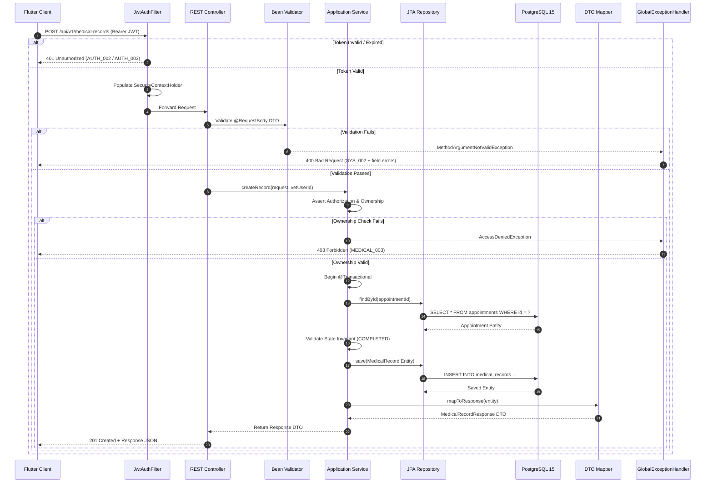

# Software Architecture Document (SAD) — Vetra Backend

**Document ID:** ARCH-02-BACKEND  
**Version:** 2.0.0  
**Status:** Approved / Active  
**Last Updated:** 2026-07-29  
**Owner:** Backend Architecture Team  
**Approver:** Principal Software Architect / CTO  
**Review Cycle:** Quarterly  
**Next Review:** 2026-10-29  
**Applies To:** `omrajput14/vetra-backend`  
**References:** [Engineering Principles](../engineering/00-principles.md), [Modular Monolith](./08-modular-monolith.md), [Domain Model](../domain/03-domain-model.md), [Database Design](../database/04-database-design.md), [API Specification](../api/06-specification.md)

---

## 1. Executive Summary

### 1.1 Purpose
This document provides a comprehensive architectural description of the **Vetra Backend** platform. It serves as the primary technical reference for software architects, backend engineers, security auditors, and DevOps personnel building, maintaining, and operating the system.

### 1.2 Scope
This document covers the core architecture of the `vetra-backend` repository, including component boundaries, layer responsibilities, data access patterns, security enforcement, transaction boundaries, infrastructure topology, and long-term scalability paths.

### 1.3 Audience
- **Backend Engineers:** For understanding system design, dependency constraints, and implementation patterns.
- **Architects & Tech Leads:** For evaluating structural integrity, technical debt, and system evolution.
- **DevOps & Security Engineers:** For managing infrastructure, deployments, and security compliance.
- **New Engineering Hires:** As the mandatory technical onboarding reference.

### 1.4 Document Ownership & Governance
- **Owner:** Backend Architecture Team
- **Approver:** CTO
- **Review Cycle:** Quarterly (or upon major architectural changes)

---

## 2. System Overview

### 2.1 Business Purpose
Vetra Backend is the core API server powering the Vetra Veterinary Operating System (VetOS). It provides multi-tenant authentication, livestock digital identity management, clinical appointment scheduling, and immutable Electronic Veterinary Medical Record (EVMR) creation for smallholder farmers and licensed field veterinarians.

### 2.2 Supported Platforms
The backend exposes a versioned RESTful JSON API supporting:
- **Vetra Mobile Application:** Cross-platform Flutter mobile client (Android & iOS).
- **Administrative & Partner Portals (Planned):** Web-based dashboards for clinic managers and government epidemiologists.

### 2.3 High-Level Architecture
The backend is designed as a **Modular Monolith** organized strictly according to **Clean Architecture** and **Domain-Driven Design (DDD)** principles. All domain capabilities execute within a single Spring Boot application process sharing a PostgreSQL database, while maintaining strict compile-time and logical module boundaries.

### 2.4 Technology Stack Baseline

| Component | Standard | Specification / Details |
|---|---|---|
| **Runtime / Language** | Java 21 LTS | OpenJDK 21 (Temurin) |
| **Application Framework** | Spring Boot 3.x | Spring Framework 6.x |
| **Security Framework** | Spring Security 6.x | Stateless JWT + Refresh Token Rotation |
| **Persistence / ORM** | Spring Data JPA | Hibernate 6.x |
| **Relational Database** | PostgreSQL 15 | PostGIS enabled for spatial capabilities |
| **Schema Migrations** | Flyway | Versioned SQL scripts (`V1__...`) |
| **Build & Tooling** | Apache Maven | Wrapper `./mvnw`, Checkstyle enforcement |
| **Containerization** | Docker | Multi-stage Dockerfile, Docker Compose |
| **API Protocol** | REST / JSON | HTTP/1.1 (Dev), HTTPS / TLS 1.3 (Staging/Prod) |
| **Identifier Format** | UUID v4 | `uuid_generate_v4()` |

---

## 3. Architectural Principles

### 3.1 Clean Architecture
Source code dependencies point **inward only**. Frameworks, databases, and HTTP transports are external implementation details surrounding the application domain:

```
┌─────────────────────────────────────────────────────────────┐
│                 Presentation Layer (REST)                   │
│   Controllers, DTOs, Request Validation, HTTP Response Envelopes│
└──────────────────────────────┬──────────────────────────────┘
                               │
┌──────────────────────────────▼──────────────────────────────┐
│                Application / Service Layer                  │
│   Use Cases, Business Rules, Authorization, State Machine       │
└──────────────────────────────┬──────────────────────────────┘
                               │
┌──────────────────────────────▼──────────────────────────────┐
│                Domain & Persistence Layer                   │
│   Domain Entities, Repositories, Flyway Migrations          │
└─────────────────────────────────────────────────────────────┘
```

### 3.2 Domain-Driven Design (DDD)
The domain model reflects the ubiquitous language of veterinary medicine. Core aggregates (`User`, `FarmerProfile`, `VetProfile`, `Animal`, `Appointment`, `MedicalRecord`) define transactional consistency boundaries and encapsulate business invariants.

### 3.3 SOLID Principles Enforcement
- **Single Responsibility (SRP):** Controllers handle HTTP transport; Services handle business workflows; Repositories handle persistence.
- **Open/Closed (OCP):** Behavior expanded through interface extensions and strategy patterns without modifying core domain logic.
- **Liskov Substitution (LSP):** Subtypes strictly fulfill contract interfaces without throwing unexpected runtime exceptions.
- **Interface Segregation (ISP):** Repositories and service interfaces are small and purpose-specific.
- **Dependency Inversion (DIP):** High-level application modules depend on repository abstractions, not concrete persistence classes.

### 3.4 Separation of Concerns
Controllers are thin and stateless. Application services manage transactions and security assertions. Database entities never leak into HTTP responses.

### 3.5 Modular Monolith Philosophy
The modular monolith delivers the architectural clarity, clear module ownership, and clean boundaries of microservices without the operational overhead of network latency, distributed transactions, container orchestration, and complex service discovery during early-to-mid growth phases.

---

## 4. Component Architecture

### 4.1 Component Diagram

```mermaid
graph TB
    subgraph Client Tier
        FlutterApp["Vetra Flutter Mobile Client<br/>(Android & iOS)"]
    end

    subgraph REST API Gateway / Ingress
        SpringSec["Spring Security Filter Chain<br/>(JwtAuthFilter)"]
        Controllers["REST Controllers<br/>(/api/v1/*)"]
    end

    subgraph Application Modules (Modular Monolith)
        AuthMod["Auth Module<br/>(Identity, JWT, Refresh Tokens, Vet Directory)"]
        AnimalMod["Animal Module<br/>(Livestock Registry, QR Passports)"]
        ApptMod["Appointment Module<br/>(Booking, State Machine)"]
        MedicalMod["Medical Record Module<br/>(Immutable EVMR Engine)"]
        DashMod["Dashboard Module<br/>(Role Metrics Aggregation)"]
    end

    subgraph Infrastructure Tier
        SharedInfra["Shared Infrastructure<br/>(Entities, Security, Config, Exception Handler)"]
    end

    subgraph Data Tier
        Postgres[(PostgreSQL 15<br/>vetra_db + PostGIS)]
    end

    FlutterApp -- "HTTPS / JSON<br/>Authorization: Bearer <JWT>" --> SpringSec
    SpringSec --> Controllers
    Controllers --> AuthMod
    Controllers --> AnimalMod
    Controllers --> ApptMod
    Controllers --> MedicalMod
    Controllers --> DashMod

    AuthMod --> SharedInfra
    AnimalMod --> SharedInfra
    ApptMod --> SharedInfra
    MedicalMod --> SharedInfra
    DashMod --> SharedInfra

    SharedInfra -- "JDBC HikariCP" --> Postgres
```

### 4.2 Module Responsibilities

| Module | Primary Responsibility | Key Entities Owned |
|---|---|---|
| **`auth`** | User authentication, registration (Farmer/Vet), JWT token issuance, refresh token management, veterinarian directory queries. | `users`, `farmer_profiles`, `vet_profiles`, `refresh_tokens` |
| **`animal`** | Livestock animal registration, ear tag indexing, unique QR code generation, Animal Passport retrieval. | `animals` |
| **`appointment`** | Appointment scheduling, vet allocation, state machine validation (`PENDING` → `CONFIRMED` → `COMPLETED`/`CANCELLED`), optimistic locking. | `appointments` |
| **`medicalrecord`** | Generation of immutable Electronic Veterinary Medical Records (EVMR), clinical history timeline queries for animals. | `medical_records` |
| **`dashboard`** | Aggregation of role-specific metrics (Farmer herd counts/upcoming appointments; Vet pending requests/daily schedule). | Read-only aggregator |
| **`infrastructure`** | Cross-cutting security filters, Flyway schema migrations, global exception handling, JPA database configuration. | System infrastructure |

---

## 5. Module Dependency Rules

### 5.1 Allowed & Forbidden Dependencies

```
┌─────────────────────────────────────────────────────────────┐
│                    Feature Modules                          │
│     auth    │    animal    │   appointment  │ medicalrecord │
└──────┬───────────┬──────────────────┬──────────────┬────────┘
       │           │                  │              │
       │   ALLOWED │                  │ ALLOWED      │
       ▼           ▼                  ▼              ▼
┌─────────────────────────────────────────────────────────────┐
│                 infrastructure Package                      │
│   Entities, Enums, Security Context, Exception Config       │
└─────────────────────────────────────────────────────────────┘
```

- **Rule 1 (Allowed):** Feature modules (`auth`, `animal`, `appointment`, `medicalrecord`, `dashboard`) MAY import from `app.vetra.infrastructure.*`.
- **Rule 2 (Forbidden):** Feature modules MUST NOT import services or controllers from other feature modules directly (e.g., `MedicalRecordService` cannot import `AppointmentService`).
- **Rule 3 (Forbidden):** Controllers MUST NOT access repository classes directly. All data access must route through application services.
- **Rule 4 (Cross-Module Reads):** Cross-module data queries are permitted only at the repository level via shared entity IDs or join interfaces defined in `infrastructure`.

### 5.2 Rationale for Module Isolation Rules
- **Prevents Spaghetti Coupling:** Ensures each module remains independently testable and maintainable.
- **Enables Zero-Friction Service Extraction:** When a module needs to scale out (e.g., extracting `medicalrecord` into an independent microservice), the extraction can be executed cleanly without refactoring circular Java dependencies.

---

## 6. Request Execution Lifecycle

### 6.1 Request Lifecycle Sequence Diagram



### 6.2 Key Execution Responsibilities

| Execution Stage | Responsible Component | Description |
|---|---|---|
| **Authentication** | `JwtAuthFilter` | Extracts Bearer JWT, validates signature/expiry, populates `SecurityContextHolder`. |
| **Input Validation** | Spring MVC + Jakarta `@Valid` | Validates request body constraints before invoking controller logic. |
| **Authorization & Ownership** | Application Service | Verifies user roles and asserts resource ownership (e.g., authenticated Vet owns appointment). |
| **Transaction Boundary** | Service (`@Transactional`) | Opens database transaction, enforces business invariants, handles optimistic locking. |
| **Persistence** | Spring Data JPA Repository | Executes parameterized SQL queries via Hibernate against PostgreSQL. |
| **DTO Mapping** | Service / DTO Mapper | Maps internal JPA domain entities into immutable public response DTOs. |
| **Exception Handling** | `GlobalExceptionHandler` | Catches uncaught exceptions and serializes standard `ApiErrorResponse` envelopes. |

---

## 7. Security Architecture

### 7.1 Authentication & Token Lifecycle
Authentication is stateless using HMAC-SHA256 (HS256) signed JSON Web Tokens (JWT):
- **Access Tokens:** Short-lived (15 minutes), containing `sub` (userId) and `role`. Carried in HTTP `Authorization: Bearer <token>` header.
- **Refresh Tokens:** Long-lived (7 days), stored in the `refresh_tokens` database table as cryptographic hashes.
- **Refresh Token Rotation:** Every refresh invocation revokes the used refresh token and issues a new access token + refresh token pair.

### 7.2 Password Hashing
All user passwords are hashed using **bcrypt** with a cost factor of 10 prior to persistence. Plaintext passwords are never logged or stored.

### 7.3 Role-Based Access Control (RBAC) & Ownership Assertions
Two primary user roles exist: `FARMER` and `VET`.
- **Role Enforcement:** Configured centrally in `SecurityConfig` via `authorizeHttpRequests`.
- **Ownership Enforcement:** Service methods explicitly assert that the resource's owner matches the `userId` extracted from the authenticated JWT context.

### 7.4 Input Validation & SQL Injection Prevention
- All incoming DTOs undergo bean validation (`@NotNull`, `@NotBlank`, `@Size`, `@DecimalMin`, `@DecimalMax`).
- SQL Injection is prevented by using parameterized JPQL / Spring Data repository methods exclusively. Dynamic native SQL string concatenation is strictly prohibited.

### 7.5 Cross-Site Request Forgery (CSRF) & HTTPS
CSRF protection is disabled (`csrf.disable()`) because the API is stateless and uses JWT Bearer tokens (not ambient browser cookies). HTTPS with TLS 1.3 is enforced at the ingress load balancer in non-local environments.

### 7.6 Secrets Management
Secrets (`JWT_SECRET`, `DB_PASSWORD`) are passed via system environment variables and must never be hardcoded or committed to source control. Production environments inject secrets via AWS Secrets Manager or HashiCorp Vault.

---

## 8. Data Architecture

### 8.1 PostgreSQL 15 & Schema Management
The relational store is **PostgreSQL 15** with the `uuid-ossp` and `postgis` extensions. All DDL alterations are managed strictly through versioned **Flyway** migrations (`V1__...` to `V6__...`). Auto-DDL (`hibernate.ddl-auto=update`) is strictly disabled in all environments.

### 8.2 Primary Keys & Timezones
- All tables utilize **UUID v4** primary keys (`uuid_generate_v4()`) to prevent sequential ID enumeration attacks.
- Timestamps are stored as `TIMESTAMP WITH TIME ZONE` (`timestamptz`) in UTC.

### 8.3 Optimistic Locking & Immutability
- Tables subject to concurrent updates (`appointments`, `medical_records`) feature a `version BIGINT NOT NULL DEFAULT 0` column managed by JPA `@Version`.
- The `medical_records` table enforces a database-level `UNIQUE` constraint on `appointment_id`, guaranteeing maximum 1 medical record per appointment. Medical records have no `UPDATE` or `DELETE` API endpoints.

### 8.4 Database Indexing Strategy
Explicit indexes are defined for:
- All foreign key columns (`idx_medical_records_animal_id`, `idx_appointments_farmer_id`, etc.)
- Status and date filter fields (`idx_appointments_status`, `idx_appointments_date`)
- Unique credentials (`users.email`, `users.phone`, `vet_profiles.registration_number`)

### 8.5 Future Data Extensions Roadmap
- **Redis Integration:** Caching tier for vet directories, static reference data, and rate-limiting counters.
- **Kafka Integration:** Asynchronous event bus for domain events (`AppointmentCompleted`, `DiseaseOutbreakReported`).
- **Elasticsearch Integration:** Full-text search index for clinical diagnoses, treatments, and regional disease history.

---

## 9. Transaction Boundaries

All business workflows executing write operations define explicit transaction boundaries using `@Transactional`:

```
┌─────────────────────────────────────────────────────────────┐
│ User Registration Transaction                               │
│  1. Save User record                                        │
│  2. Save FarmerProfile OR VetProfile record                 │
│  (Atomic — all commit or all rollback)                      │
└─────────────────────────────────────────────────────────────┘

┌─────────────────────────────────────────────────────────────┐
│ Appointment State Transition Transaction                    │
│  1. Fetch Appointment by ID (check @Version)                │
│  2. Assert valid state transition (e.g. PENDING->CONFIRMED) │
│  3. Save updated Appointment                                │
└─────────────────────────────────────────────────────────────┘

┌─────────────────────────────────────────────────────────────┐
│ Medical Record Creation Transaction                         │
│  1. Fetch Appointment by ID                                 │
│  2. Assert Appointment status == COMPLETED                  │
│  3. Assert no existing Medical Record for Appointment       │
│  4. Save MedicalRecord record (Database UNIQUE enforced)    │
└─────────────────────────────────────────────────────────────┘

┌─────────────────────────────────────────────────────────────┐
│ Refresh Token Rotation Transaction                          │
│  1. Find Refresh Token by Hash                              │
│  2. Mark old Refresh Token as revoked = TRUE                │
│  3. Insert new Refresh Token record                         │
└─────────────────────────────────────────────────────────────┘
```

**Rule:** Read-only service methods explicitly declare `@Transactional(readOnly = true)` to optimize database connection and flush behaviors.

---

## 10. Error Handling Strategy

### 10.1 Centralized Exception Handling
The `GlobalExceptionHandler` intercepts all uncaught exceptions across the application and maps them to standard HTTP status codes and machine-readable error codes.

### 10.2 HTTP Status & Error Code Mapping

| Status Code | Primary Cause | Typical Error Code |
|---|---|---|
| `400 Bad Request` | Validation failure or malformed JSON | `SYS_002`, `SYS_003` |
| `401 Unauthorized` | Invalid, expired, or missing JWT | `AUTH_001`, `AUTH_002`, `AUTH_003` |
| `403 Forbidden` | Insufficient role or resource ownership check failed | `AUTH_006`, `ANIMAL_002`, `MEDICAL_003` |
| `404 Not Found` | Entity missing or resource belongs to another tenant | `USER_004`, `ANIMAL_001`, `APPT_001` |
| `409 Conflict` | Optimistic lock failure or unique constraint violation | `USER_001`, `APPT_006`, `MEDICAL_004` |
| `422 Unprocessable` | Invalid state transition invariant broken | `APPT_004`, `APPT_008` |
| `500 Server Error` | Unexpected internal server error | `SYS_001` |

### 10.3 Standard API Error Envelope

```json
{
  "error": {
    "code": "MEDICAL_004",
    "message": "A medical record has already been created for this appointment.",
    "details": null,
    "timestamp": "2026-07-29T12:00:00Z",
    "path": "/api/v1/medical-records"
  }
}
```

---

## 11. Package Structure Conventions

Every feature module inside `app.vetra` follows a standardized package layout:

```
app.vetra.<module_name>/
├── controller/          ← REST Controllers (@RestController)
│   └── <Name>Controller.java
├── service/             ← Application Services (@Service, @Transactional)
│   ├── <Name>Service.java
│   └── impl/<Name>ServiceImpl.java
├── repository/          ← Spring Data Repositories (@Repository)
│   └── <Name>Repository.java
├── dto/                 ← Immutable Java Records for Request/Response DTOs
│   ├── request/
│   │   └── Create<Name>Request.java
│   └── response/
│       └── <Name>Response.java
├── mapper/              ← Entity-to-DTO Mappers
│   └── <Name>Mapper.java
├── exception/           ← Module-specific domain exceptions
│   └── <Name>Exception.java
└── config/              ← Module-specific Spring bean definitions
```

---

## 12. Infrastructure & Operations

### 12.1 Containerization (Docker)
The backend compiles into an alpine JRE container using a multi-stage `Dockerfile`:
- **Build Stage:** `eclipse-temurin:21-jdk-alpine` (compiles source and executes Checkstyle)
- **Runtime Stage:** `eclipse-temurin:21-jre-alpine` (runs lightweight optimized executable JAR)

### 12.2 Environment Configuration Profiles

| Profile Name | Environment | Target Usage |
|---|---|---|
| `dev` | Local Development | Host JVM + Docker Compose PostgreSQL (`docker-compose.dev.yml`) |
| `test` | Automated Testing | JUnit 5 + Testcontainers PostgreSQL |
| `staging` | Staging / QA | Cloud container instance + RDS PostgreSQL |
| `prod` | Production | AWS ECS Fargate + Multi-AZ RDS PostgreSQL |

### 12.3 Health Checks & Observability
Spring Boot Actuator exposes operational health endpoints:
- `GET /actuator/health` — Used by ALB/ECS load balancers for container readiness/liveness.
- Logging is structured via Logback (`SLF4J`) outputting JSON format in staging/production for CloudWatch ingestion.

---

## 13. Scalability Strategy & Migration Path

Vetra follows a progressive, evidence-based scaling path:

```
Step 1: Modular Monolith (Current State)
├── Single JVM process, Spring Boot 3, Java 21
└── Handles up to 500 concurrent active users

Step 2: Read Replicas & Redis Caching (Phase 2 - Planned)
├── Introduce Redis for vet directory and dashboard caching
└── Add PostgreSQL read replicas for intensive history queries

Step 3: Asynchronous Event Streaming (Phase 3 - Planned)
├── Introduce Apache Kafka / RabbitMQ for domain events
└── Decouple push notifications and spatial analysis from request path

Step 4: Container Orchestration (Phase 4 - Planned)
└── Deploy Spring Boot instances to Kubernetes (EKS) behind load balancers

Step 5: Microservice Extraction (Future Scale Only)
└── Extract bounded contexts (e.g. evmr-service, disease-service) ONLY when team size or independent scaling metrics justify extraction
```

### Why Vetra Is NOT Using Microservices Today
1. **Team Velocity:** Single core backend engineering team; microservices introduce severe distributed tracing, network latency, and deployment complexity overhead.
2. **Data Consistency:** Core veterinary workflows (appointment state transitions to EVMR) benefit immensely from ACID database transactions.
3. **Clean Module Boundaries:** The modular monolith provides 90% of the architectural isolation benefits of microservices at 10% of the operational cost.

---

## 14. Deployment Architecture

```mermaid
graph TB
    subgraph Client Layer
        Flutter["Flutter Mobile App<br/>(Android / iOS)"]
    end

    subgraph Edge & Ingress Layer
        Route53["AWS Route 53<br/>(DNS)"]
        ALB["AWS Application Load Balancer<br/>(HTTPS / SSL Termination)"]
    end

    subgraph Compute Tier (AWS ECS Fargate)
        AppNode1["Spring Boot Instance 1<br/>(Java 21 container)"]
        AppNode2["Spring Boot Instance 2<br/>(Java 21 container)"]
    end

    subgraph Data & Storage Tier
        PrimaryDB[(AWS RDS PostgreSQL 15<br/>Primary Multi-AZ)]
        ReadDB[(AWS RDS Read Replica<br/>Future)]
        S3Storage["AWS S3 Bucket<br/>(Animal Photos & Attachments - Future)"]
    end

    subgraph Caching & Messaging (Future Tiers)
        RedisCache[("Redis Cache Cluster<br/>Future")]
        KafkaBus["Apache Kafka Event Bus<br/>Future"]
    end

    Flutter -- "HTTPS :443" --> Route53
    Route53 --> ALB
    ALB -- "HTTP :8080" --> AppNode1
    ALB -- "HTTP :8080" --> AppNode2

    AppNode1 -- "JDBC Connection Pool" --> PrimaryDB
    AppNode2 -- "JDBC Connection Pool" --> PrimaryDB
    PrimaryDB -.->|Replication| ReadDB

    AppNode1 -.-> RedisCache
    AppNode2 -.-> KafkaBus
    AppNode1 -.-> S3Storage
```

---

## 15. Non-Negotiable Architectural Constraints

1. **No JPA Entities in Controllers:** Controllers MUST receive and return immutable DTO records only. JPA Entities must never cross the application service boundary.
2. **No Business Logic in Controllers:** Controllers must strictly perform request parsing, `@Valid` assertion, delegation to application service, and HTTP status wrapping.
3. **No Direct Database Access in Controllers:** All database access must route through application services.
4. **No Cross-Module Repository Access:** Services in module A must never import repositories or services from module B directly.
5. **Flyway Migration Only:** Schema modifications must be executed via Flyway SQL migration scripts. Hibernate auto-DDL is strictly prohibited.
6. **UUID Primary Keys Only:** All domain entity primary keys must use UUID v4.
7. **Immutable Medical Records:** `MedicalRecord` entities are immutable. No `PUT` or `DELETE` endpoints shall exist for medical records.
8. **No Circular Dependencies:** Package dependencies must be acyclic. Enforced via static analysis tooling.

---

## 16. Quality Attributes & Software SLAs

| Attribute | Target Metric | Architectural Control |
|---|---|---|
| **Availability** | 99.9% Monthly Uptime | Multi-AZ RDS, stateless application instances behind ALB. |
| **Performance** | Latency < 150 ms (p95) | Database indexing, HikariCP connection pooling, lightweight DTO projections. |
| **Security** | Zero unauthorized data access | Spring Security 6, JWT refresh rotation, explicit ownership assertions in services. |
| **Maintainability** | Clean Architecture layer compliance | Checkstyle linting, strict module package isolation rules. |
| **Scalability** | Support 500+ CCU | Stateless application design, future Redis caching and read replicas. |
| **Testability** | ≥ 90% service line coverage | JUnit 5 unit tests with Mockito + Testcontainers integration tests. |
| **Observability** | 100% request trace correlation | SLF4J MDC `traceId` propagation across all log entries. |
| **Reliability** | Zero data loss on sync | DB unique constraints + optimistic locking (`version`). |

---

## 17. Future Evolution Roadmap

The backend architecture evolves strictly based on measurable scale triggers:

```
Phase 1: Foundation (Current - Java 21, Spring Boot 3, PostgreSQL 15, Flyway)
Phase 2: Performance Tier (Redis Caching + RDS Read Replicas)
Phase 3: Event-Driven Infrastructure (Kafka / RabbitMQ Domain Events)
Phase 4: Search & Analytics Tier (Elasticsearch Indexing for Diagnoses)
Phase 5: Cloud Native Orchestration (Kubernetes EKS Deployment)
Phase 6: Selective Service Extraction (Microservices for high-scale contexts only)
```

Service extraction will only occur when a module meets **both** of the following criteria:
1. The module requires independent scaling rates at least 5× greater than the rest of the application.
2. The module is maintained by a dedicated engineering team of 3+ developers.
