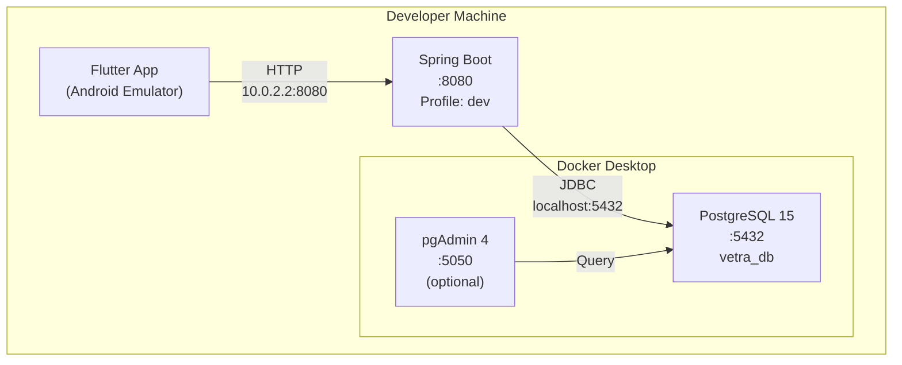
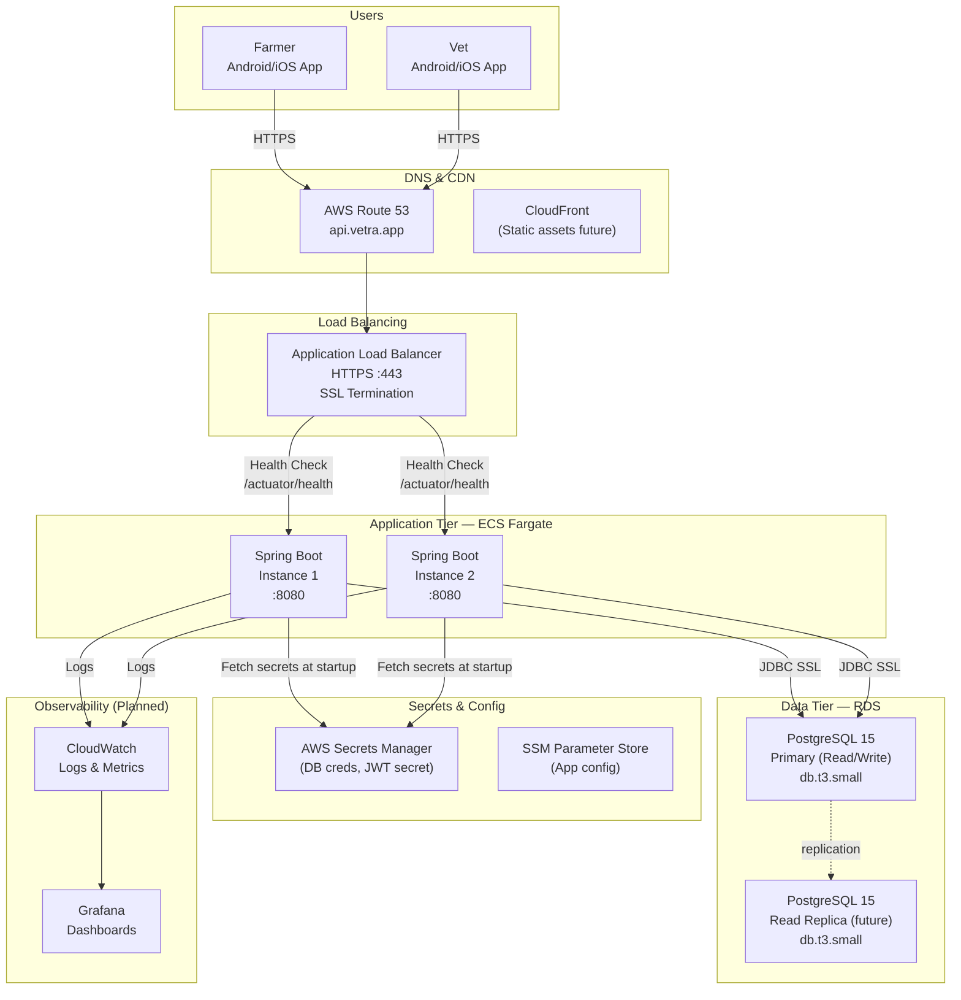
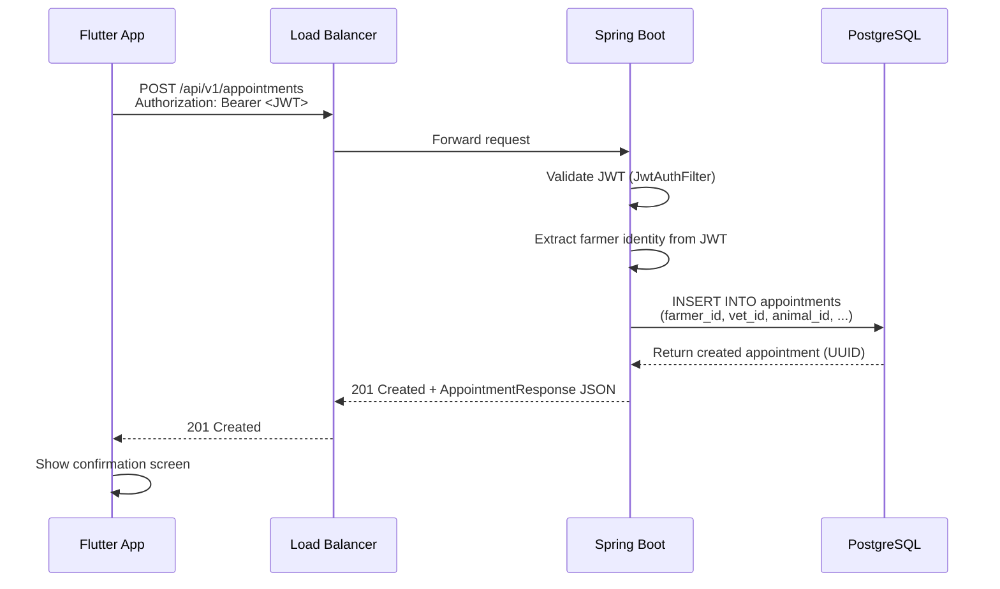

# Infrastructure Diagram
**Document ID:** ARCH-10  
**Status:** Active  
**Last Updated:** 2026-07-29  
**Applies To:** `omrajput14/vetra-backend`  
**References:** [Deployment Architecture](./09-deployment.md), [Security Design](../security/11-security-design.md)

---

## Current Infrastructure (Local Development)

---

## Planned Production Infrastructure (AWS)

---

## Network Security Groups (Planned)

| Component | Inbound | Outbound |
|---|---|---|
| ALB | 443 from 0.0.0.0/0 | 8080 to App tier |
| App tier (ECS) | 8080 from ALB only | 5432 to DB tier, 443 to AWS services |
| DB tier (RDS) | 5432 from App tier only | None |

**Principle:** Minimum necessary network access. The database is never directly reachable from the internet.

---

## Data Flow: Farmer Books Appointment

---

## Port Reference

| Component | Port | Protocol | Environment |
|---|---|---|---|
| Spring Boot (local) | 8080 | HTTP | Local only |
| PostgreSQL (Docker) | 5432 | TCP | Local only |
| pgAdmin (Docker) | 5050 | HTTP | Local only |
| ALB (production) | 443 | HTTPS | Staging/Production |
| RDS (production) | 5432 | TCP/SSL | App tier only |
