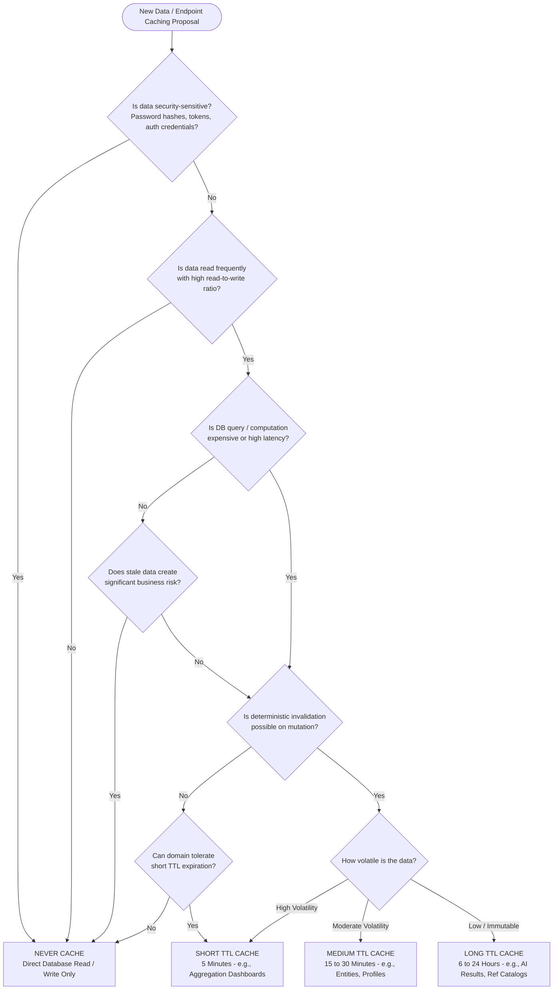

# Vetra Backend — Enterprise Caching Architecture Specification (Stage 12.3.2)

## Executive Summary & Milestone Boundary

This document specifies the authoritative enterprise caching architecture for the **Vetra Backend Platform**.

In accordance with the enterprise engineering roadmap, **Stage 12.3.2 is purely architectural**. It establishes standards, classifications, key conventions, TTL matrices, invalidation strategies, decision trees, governance rules, and constant definitions. Runtime Spring cache manager beans, Jackson cache serialization wiring, and `@Cacheable` service bindings are explicitly deferred to **Stage 12.3.3 (Service-Level Cache Implementation)**.

---

## 1. Enterprise Cache Decision Framework

Before introducing any new cache to the Vetra platform, developers must evaluate the proposed data entity using the following standardized decision tree.



### Framework Evaluation Questions

1. **Security Policy**: Is the data security-sensitive (e.g., passwords, refresh tokens, credentials)? $\rightarrow$ **Never Cache**.
2. **Read-to-Write Ratio**: Is the data requested frequently across hot paths? $\rightarrow$ If low, **Never Cache**.
3. **Computational Cost**: Is the SQL query complex (JOINs, GROUP BYs) or AI inference expensive? $\rightarrow$ Strong candidate.
4. **Business Risk**: Does serving stale data cause domain inconsistency or financial risk? $\rightarrow$ Evaluate invalidation or **Never Cache**.
5. **Volatility & Invalidation**: Can writes trigger immediate explicit eviction? $\rightarrow$ Determines TTL category (Short, Medium, or Long).

---

## 2. Enterprise Cache Audit & Domain Classifications

Every entity, endpoint, and query pattern across the Vetra platform is audited and classified into four operational caching categories.

### Operational Classifications

| Category | Definition | Invalidation Policy | Example Domains |
|----------|------------|---------------------|-----------------|
| **Cache Candidate** | High-read, moderate-write operational domain entities accessed frequently by primary key or deterministic lookup. | Evict on write (Create/Update/Delete) | Users, Animals, Appointments, Medical Records |
| **Short-lived Cache** | Highly dynamic aggregation endpoints or temporal validation data subject to frequent state changes. | TTL-based expiration + targeted eviction | Dashboards (Farmer/Vet/Admin), OTP verification |
| **Long-lived Cache** | Immutable, slow-changing, or computationally expensive outputs (e.g., AI inference, reference catalogs). | High TTL (12-24h) + explicit manual flush | AI Diagnosis, Reference Data, Analytics |
| **Never Cache** | Sensitive security credentials, audit trails, real-time message streams, or transactional state transitions. | N/A (Direct DB read/write only) | Passwords/Hashes, Delivery Logs, Direct Financial Trx |

### Domain Audit Matrix

| Domain | Entity / Endpoint / Query | Classification | Justification |
|--------|---------------------------|----------------|---------------|
| **Auth** | OTP Code (`vetra:otp:{phone}`) | Short-lived Cache | 5-minute ephemeral lifespan. Rapid lookups during SMS login flow. |
| **Auth** | User Security Principal (`vetra:user:{id}`) | Cache Candidate | Read on every authenticated API request via JWT filter. High-frequency read. |
| **User** | User Profile (`vetra:user_profile:{id}`) | Cache Candidate | Accessed on profile views and UI headers. Updated infrequently. |
| **Animal** | Livestock Entity (`vetra:animal:{id}`) | Cache Candidate | Read frequently during medical checks, appointments, and dashboard views. |
| **Appointment** | Appointment Entity (`vetra:appointment:{id}`) | Cache Candidate | Accessed by farmers and vets. High read frequency. Evicted on status change. |
| **Medical Record**| EVMR Entity (`vetra:medical_record:{id}`) | Cache Candidate | Permanent clinical history. Read heavily during consultation; updated rarely. |
| **AI Engine** | AI Diagnosis Result (`vetra:ai:{imageHash}`) | Long-lived Cache | Multi-provider inference is computationally expensive ($ and latency). Deduplicated by SHA-256 image hash. |
| **Disease Surveillance**| Disease Report (`vetra:disease_report:{id}`) | Cache Candidate | Spatial & tabular surveillance queries. Evicted on diagnosis status updates. |
| **Disease Surveillance**| Outbreak Cluster (`vetra:outbreak:{id}`) | Short-lived Cache | Evaluated dynamically during spatial clustering. Evicted when risk score/radius changes. |
| **Dashboard** | Farmer Aggregation (`vetra:dashboard:farmer:{id}`) | Short-lived Cache | Aggregates animal count, upcoming appointments, and active alerts. 5m TTL. |
| **Dashboard** | Vet Aggregation (`vetra:dashboard:vet:{id}`) | Short-lived Cache | Aggregates assigned appointments, pending reports, and active outbreaks. 5m TTL. |
| **Dashboard** | Admin Aggregation (`vetra:dashboard:admin`) | Short-lived Cache | Platform-wide macro metrics. Heavy SQL GROUP BYs. 5m TTL. |
| **Notifications** | Notification Templates & Device Tokens | Cache Candidate | Template lookup per notification dispatch. High read, zero write during runtime. |
| **Reference Data** | Disease Catalog & Species Reference | Long-lived Cache | Static master catalogs. Zero write frequency during standard operations. 12h TTL. |
| **Analytics** | Epidemiological Statistics | Long-lived Cache | Heavy spatial-temporal queries across historical disease reports. 24h TTL. |
| **Security Audit**| Password Hashes & Refresh Tokens | Never Cache | Security risk to cache credentials in shared memory. Must validate against DB. |
| **Notification Log**| Transmission Delivery Logs | Never Cache | Write-only audit trail. Never read in hot paths. |

---

## 3. Centralized Cache Registry & Ownership Matrix

All cache regions are centrally defined in **[CacheNames.java](file:///Users/0mrajput/vetra-backend/src/main/java/app/vetra/infrastructure/cache/CacheNames.java)**. Each cache region has a designated **Owner Service** responsible for creation, updates, invalidation, and maintenance.

```
┌────────────────────────────────────────────────────────────────────────────────────────────────────────┐
│                               CENTRAL CACHE REGISTRY & OWNERSHIP MATRIX                                │
├──────────────────┬──────────────┬───────────────────────────────┬──────────────┬───────────┬───────────┤
│ Cache Region     │ Owner        │ Responsible Service           │ Operational  │ Default   │ Evict     │
│ Name             │ Domain       │ (Governance Owner)            │ Purpose      │ TTL       │ Method    │
├──────────────────┼──────────────┼───────────────────────────────┼──────────────┼───────────┼───────────┤
│ otp              │ Auth         │ AuthService                   │ SMS OTP code │ 5 minutes │ On Verify │
│ dashboard_farmer │ Dashboard    │ DashboardAggregationService   │ Farmer DTO   │ 5 minutes │ Event/TTL │
│ dashboard_vet    │ Dashboard    │ DashboardAggregationService   │ Vet DTO      │ 5 minutes │ Event/TTL │
│ dashboard_admin  │ Dashboard    │ DashboardAggregationService   │ Admin DTO    │ 5 minutes │ Scheduled │
│ animals          │ Animal       │ AnimalService                 │ Livestock    │ 15 mins   │ On Write  │
│ appointments     │ Appointment  │ AppointmentService            │ Schedule     │ 15 mins   │ On Write  │
│ medical_records  │ MedicalRecord│ MedicalRecordService          │ EVMR Record  │ 30 mins   │ On Write  │
│ users            │ Auth         │ UserService                   │ Principal    │ 30 mins   │ On Write  │
│ user_profiles    │ Auth         │ UserService                   │ Profile      │ 30 mins   │ On Write  │
│ disease_reports  │ Disease      │ DiseaseSurveillanceService    │ Report       │ 1 hour    │ On Write  │
│ outbreaks        │ Disease      │ OutbreakIntelligenceService   │ Cluster      │ 1 hour    │ On Write  │
│ notifications    │ Notification │ NotificationService           │ Templates    │ 1 hour    │ On Write  │
│ settings         │ Platform     │ SystemSettingsService         │ Feature Flags│ 6 hours   │ On Write  │
│ reference_data   │ Platform     │ ReferenceDataService          │ Master Cat   │ 12 hours  │ On Admin  │
│ ai_diagnosis     │ AI           │ AIOrchestratorService         │ Hash Result  │ 24 hours  │ Manual    │
│ analytics        │ Analytics    │ DiseaseIntelligenceAutomation │ Stats        │ 24 hours  │ Scheduled │
└──────────────────┴──────────────┴───────────────────────────────┴──────────────┴───────────┴───────────┘
```

---

## 4. Cache Architecture Standards & Constants

The constants defining cache infrastructure boundaries reside in `app.vetra.infrastructure.cache`:

1. **`CacheNames`**: Single source of truth for cache region names (`public static final String USERS = "users"`, etc.).
2. **`CacheTtl`**: Strongly typed `java.time.Duration` constants defining the expiration boundary for each cache region.
3. **`CacheKeys`**: Utility class producing deterministic, collision-free key formats formatted as `vetra:<domain>:<id>`.

---

## 5. Time-To-Live (TTL) Policy Matrix

Defined as strongly typed constants in **[CacheTtl.java](file:///Users/0mrajput/vetra-backend/src/main/java/app/vetra/infrastructure/cache/CacheTtl.java)**:

```
       5 min          15 min          30 min           1 hour           6 hours          12-24 hours
     ┌──────────────┬───────────────┬───────────────┬────────────────┬────────────────┬─────────────────┐
     │ OTP          │ Animals       │ MedicalRecs   │ Disease Reports│ App Settings   │ Reference Data  │
     │ Dashboards   │ Appointments  │ Users         │ Outbreaks      │                │ AI Diagnosis    │
     │              │               │ User Profiles │ Notifications  │                │ Analytics       │
     └──────────────┴───────────────┴───────────────┴────────────────┴────────────────┴─────────────────┘
     ◄ HIGH VOLATILITY / TEMPORAL                                            LOW VOLATILITY / COMPUTATIONAL ►
```

---

## 6. Deterministic Cache Naming Standards

Defined in **[CacheKeys.java](file:///Users/0mrajput/vetra-backend/src/main/java/app/vetra/infrastructure/cache/CacheKeys.java)** following the pattern $\text{vetra}:\langle \text{domain} \rangle:\langle \text{identifier} \rangle$:

- `vetra:user:{id}`
- `vetra:user_profile:{id}`
- `vetra:animal:{id}`
- `vetra:appointment:{id}`
- `vetra:medical_record:{id}`
- `vetra:ai:{imageHash}`
- `vetra:disease_report:{id}`
- `vetra:outbreak:{id}`
- `vetra:dashboard:farmer:{farmerId}`
- `vetra:dashboard:vet:{vetId}`
- `vetra:dashboard:admin`
- `vetra:otp:{phone}`
- `vetra:ref:{category}`

---

## 7. Cache Invalidation Strategy

Data updates trigger explicit cache invalidation to prevent stale reads. Cascade eviction propagates invalidations down the entity dependency hierarchy.

### Invalidation Matrix

| Mutation Event | Direct Target Evicted | Cascade Eviction Targets |
|----------------|----------------------|--------------------------|
| `Update Animal` | `vetra:animal:{id}` | `vetra:dashboard:farmer:{farmerId}`, `vetra:analytics` |
| `Update Appointment` | `vetra:appointment:{id}` | `vetra:dashboard:farmer:{farmerId}`, `vetra:dashboard:vet:{vetId}` |
| `Create MedicalRecord`| `vetra:medical_record:{id}` | `vetra:animal:{animalId}`, `vetra:appointment:{aptId}`, `vetra:dashboard:farmer:{farmerId}`, `vetra:dashboard:vet:{vetId}` |
| `Create DiseaseReport`| `vetra:disease_report:{id}`| `vetra:outbreak:{clusterId}`, `vetra:dashboard:vet:{vetId}`, `vetra:dashboard:admin`, `vetra:analytics` |
| `Update Outbreak` | `vetra:outbreak:{id}` | `vetra:dashboard:admin`, `vetra:analytics` |
| `Update User Profile` | `vetra:user_profile:{id}`, `vetra:user:{id}` | `vetra:dashboard:farmer:{id}` or `vetra:dashboard:vet:{vetId}` |

---

## 8. Monitoring & Metrics Strategy Design

Designed for Spring Boot Actuator, Micrometer, Prometheus, and Grafana:
- **Cache Hit Ratio**: $\text{hits} / (\text{hits} + \text{misses}) > 85\%$
- **Cache Miss Rate**: Stampede detection
- **Eviction Count**: Alerts on Redis memory pressure
- **Redis Command Latency**: Target $p_{99} < 5\text{ ms}$
- **Redis Memory Usage**: Alert boundary at $> 85\%$ capacity

---

## 9. Performance Success Criteria (KPIs for Stage 12.3.3 & 12.3.4)

| Metric / Goal | Target Benchmark | Architectural Justification |
|---------------|------------------|-----------------------------|
| **Cache Hit Ratio** | $> 85\%$ | High hit ratios ensure the cache actively shields PostgreSQL from repetitive read workloads. |
| **Redis $p_{99}$ Latency** | $< 5\text{ ms}$ | Ensures cache lookups add minimal overhead to response times over the Lettuce connection pool. |
| **Dashboard API Response Time** | $40\%\text{--}60\%$ Reduction | Aggregation endpoints perform complex SQL JOINs; caching pre-aggregated DTOs drastically cuts response latency. |
| **Database Query Volume** | $> 40\%$ Reduction | Offloading entity reads for hot records (Users, Animals, Appointments) reduces database connection pressure. |
| **Repeated AI Inference Volume** | $> 70\%$ Reduction | SHA-256 image hash caching prevents duplicate external LLM/Vision API calls, saving execution cost and time. |
| **Redis Infrastructure Availability**| $99.9\%$ | High availability guarantees cache failures do not bring down backend operational services. |
| **Memory Utilization Alert Threshold**| $80\%\text{--}85\%$ | Early alerting prevents Redis out-of-memory (OOM) evictions and unexpected LRU purges. |

---

## 10. Cache Governance Rules

Future backend development must adhere strictly to these architectural governance rules:

1. **No Hardcoded Cache Names**: Every cache region string must use constants from `CacheNames`.
2. **No Hardcoded TTLs**: Every cache TTL duration must be referenced from `CacheTtl`.
3. **Standardized Key Generation**: All cache keys must be generated via `CacheKeys` methods using the `vetra:<domain>:<id>` format.
4. **Mandatory Invalidation Specification**: No service may introduce a cache without documenting its mutation invalidation flow.
5. **Single Ownership Responsibility**: Each cache region is owned by exactly one service as defined in the Cache Ownership Matrix.
6. **Architecture Review Required**: Introducing a new cache region requires architecture team review and inclusion in `25-caching-architecture.md`.
7. **Prohibition of Undocumented Caches**: No business service or repository may introduce undocumented runtime caches or ad-hoc key formats.

---

## 11. Deferred Implementation Items (Stage 12.3.3 Roadmap)

The following implementation components have been intentionally separated and deferred to **Stage 12.3.3**:

1. `RedisCacheManager` bean provisioning (`CacheConfiguration.java`)
2. Per-cache `RedisCacheConfiguration` TTL binding maps
3. `GenericJackson2JsonRedisSerializer` value serialization configuration
4. Null value caching prohibition (`disableCachingNullValues()`)
5. Service-level `@Cacheable`, `@CacheEvict`, and `@CachePut` bindings across business domains
6. Integration testing with Spring `CacheManager` runtime beans
