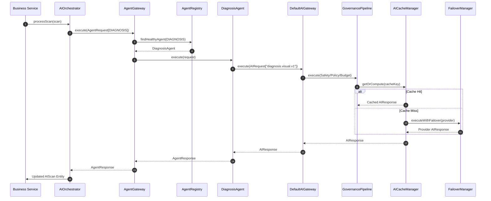

# Enterprise Multi-Agent Framework Architecture

## Overview

Stage 13.0.9 elevates Vetra into an **Enterprise Multi-Agent Orchestration Platform**. Business services interact with specialized AI agents rather than manipulating raw prompt templates or providers directly.

The underlying AI Platform v1.0 execution pipeline (`DefaultAIGateway` → `AIGovernancePipeline` → `AICacheManager` → `FailoverManager` → `ProviderRouter` → `AIProvider`) remains **completely frozen and immutable**, reused seamlessly by all agents.

```text
       Business Services (AIScanService, etc.)
                          │
                          ▼
                    AIOrchestrator
                          │
                          ▼
                     AgentGateway
                          │ (Queries AgentRegistry)
                          ▼
                    AgentRegistry
       ┌──────────────────┼──────────────────┬──────────────────┐
       ▼                  ▼                  ▼                  ▼
DiagnosisAgent     TreatmentAgent     KnowledgeAgent       ReportAgent
(diagnosis.visual) (treatment.rec)   (knowledge.disease) (report.summary)
       │                  │                  │                  │
       └──────────────────┴─────────┬────────┴──────────────────┘
                                    │ (Domain-agnostic AIRequest)
                                    ▼
                             DefaultAIGateway
                                    │
                                    ▼
                           AIGovernancePipeline
                                    │
                                    ▼
                              AICacheManager
                                    │
                                    ▼
                              FailoverManager
                                    │
                                    ▼
                              ProviderRouter
                                    │
                                    ▼
                               AIProvider
```

---

## Core Components

### 1. Agent Domain Contracts (`app.vetra.ai.agent.model`)
- **`AgentCapability`**: Specialized business capability enum (`DIAGNOSIS`, `TREATMENT`, `REPORT`, `IMAGE_ANALYSIS`, `KNOWLEDGE`, `SUMMARIZATION`).
- **`AgentHealth`**: Operational state of an agent (`HEALTHY`, `DEGRADED`, `UNAVAILABLE`, `DISABLED`).
- **`AgentRequest`**: Immutable record containing capability, variable map, optional image URL, execution context, and metadata.
- **`AgentResponse`**: Immutable record wrapping the underlying `AIResponse`, executing agent name, capability, and metadata.

### 2. Specialized Agents (`app.vetra.ai.agent.impl`)

| Agent | Supported Capabilities | Prompt Template | Responsibility |
| :--- | :--- | :--- | :--- |
| **`DiagnosisAgent`** | `DIAGNOSIS`, `IMAGE_ANALYSIS` | `diagnosis.visual.v1` | Visual clinical livestock diagnosis from images. |
| **`TreatmentAgent`** | `TREATMENT` | `treatment.recommendation.v1` | Evidence-based medication, clinical protocols, and dosage guidance. |
| **`KnowledgeAgent`** | `KNOWLEDGE` | `knowledge.disease.v1` | Veterinary encyclopedic knowledge and disease etiology (ready for RAG). |
| **`ReportAgent`** | `REPORT`, `SUMMARIZATION` | `report.summary.v1` | Medical summaries, case documentations, and exportable reports. |

### 3. Agent Gateway & Registry (`app.vetra.ai.agent.gateway`, `app.vetra.ai.agent.registry`)
- **`AgentRegistry`**: Discovers all Spring beans implementing `AIAgent`, indexes by capability, and returns the primary healthy agent.
- **`AgentGateway`**: Public entry point for agent execution. Resolves healthy agents from `AgentRegistry`, emits span events (`ai.agent.selected`), and records operational metrics.

---

## Sequence Diagram



---

## Extension Guide: Adding a New Agent

To introduce a new specialized agent (e.g. `NutritionAgent` or `EpidemiologyAgent`):

1. Add a capability to `AgentCapability` (e.g. `NUTRITION`).
2. Add a prompt descriptor in `src/main/resources/prompts/nutrition/nutrition.diet.v1.json`.
3. Create the Spring component implementing `AIAgent`:
   ```java
   @Component
   public class NutritionAgent implements AIAgent {
     private final AIGateway aiGateway;
     private final AgentProperties properties;
     ...
   }
   ```
4. `AgentRegistry` will automatically discover and index the new agent at application startup. No changes to `AgentGateway` or business services are required.
