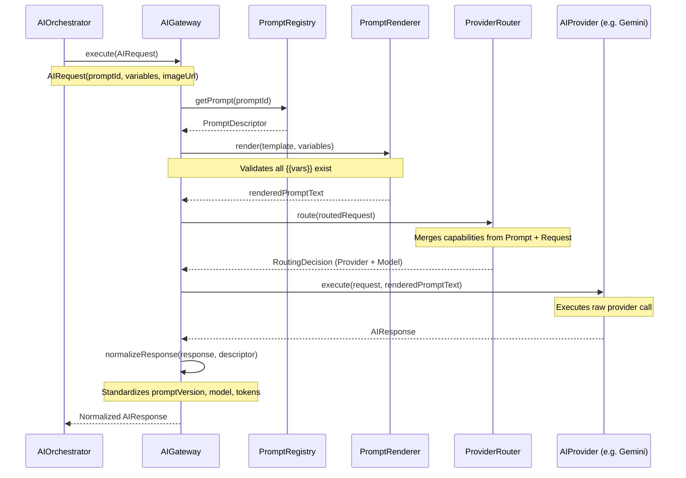

# AI Gateway Architecture

The AI Gateway is the central execution layer of the Vetra AI platform. It serves as the single entry point for all outbound LLM and Vision AI interactions, ensuring that prompts, context variables, provider selection, and API execution are uniformly handled, tracked, and resilient.

## Core Concepts

The architecture strictly decouples business orchestration from provider communication.

1. **AIGateway (Interface)**
   The facade for all AI executions. It consumes a domain-agnostic `AIRequest` and produces a normalized `AIResponse`.

2. **PromptRegistry & PromptTemplateLoader**
   Prompts are externalized as JSON descriptors loaded from the classpath (`src/main/resources/prompts/`). This allows prompts to be managed, versioned, and adjusted independently of code compilation.

3. **PromptRenderer**
   A strict, deterministic template engine. It extracts required variables from the prompt template (`{{variable}}`) and enforces that the caller (`AIRequest`) provides all required context. Missing variables result in immediate fast-fail exceptions.

4. **ProviderRouter (Registry Layer)**
   Uses capabilities extracted from both the `PromptDescriptor` and the incoming `AIRequest` to route the execution to the most suitable provider and model via the `ProviderRegistry` and `ModelRegistry`.

## Execution Flow

When a service (e.g., `AIOrchestrator`) initiates an AI inference request, the following sequence occurs:

## Resilience and Fallback

During local development and testing, or if external APIs are unavailable, the `NoOpAIProvider` can be used. It simulates a successful execution, returning a deterministic JSON payload mapped to the prompt's required schema, allowing the CI pipeline and local workflows to complete without hitting external endpoints.

## Future Milestones
- **Resilience**: Implementing circuit breakers and retries around the `execute` layer.
- **Failover**: Adding capability-aware automatic failover within `ProviderRouter`.
- **Budgeting/Throttling**: Implementing cost controls using the token usage tracked in `AIResponse`.
