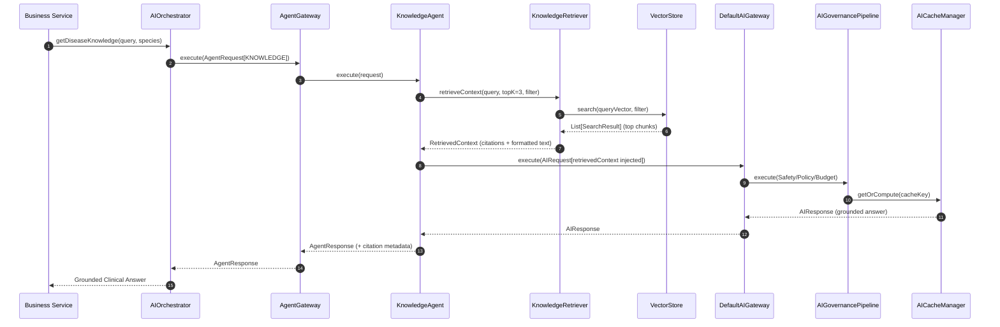

# Enterprise Veterinary Knowledge Platform (RAG) Architecture

## Overview

Stage 13.1.0 transforms `KnowledgeAgent` into an enterprise **Retrieval-Augmented Generation (RAG)** agent. It equips the veterinary platform with trusted clinical document ingestion, semantic chunking, vector embedding generation, vector similarity search, and ground-truth context injection.

The core execution pipeline (`DefaultAIGateway` → `AIGovernancePipeline` → `AICacheManager` → `FailoverManager` → `ProviderRouter` → `AIProvider`) and the Multi-Agent Framework (`AgentGateway` → `AgentRegistry` → `AIAgent`) remain **completely frozen and immutable**.

```text
                             Business Service
                                    │
                                    ▼
                              AIOrchestrator
                                    │
                                    ▼
                               AgentGateway
                                    │ (Resolves from AgentRegistry)
                                    ▼
                             KnowledgeAgent
                                    │
             ┌──────────────────────┴──────────────────────┐
             ▼ (1. Semantic Retrieval)                     │ (2. Grounded Prompt)
     KnowledgeRetriever                                    ▼
             │                                        DefaultAIGateway
             ▼                                             │
      RetrievalStrategy                                    ▼
             │                                    AIGovernancePipeline
             ▼                                   (Safety, Policy, Budget)
        VectorStore                                        │
   (Cosine + Metadata Filter)                              ▼
             ▲                                       AICacheManager
             │ (Embeddings)                                │
     EmbeddingProvider                                     ▼
             ▲                                       FailoverManager
             │                                             │
   DocumentIngestionService                                ▼
   (Parser → Chunker → Embed)                        ProviderRouter
                                                           │
                                                           ▼
                                                       AIProvider
```

---

## Core Components

### 1. Domain Models (`app.vetra.ai.rag.model`)
- **`KnowledgeDocument`**: Domain representation of veterinary literature or clinical protocol (id, title, author, category, rawContent, format, metadata, timestamp).
- **`KnowledgeChunk`**: Segmented text chunk with token count and contextual metadata (species, disease, category). Raw embedding vectors are encapsulated internally in `VectorStore`.
- **`Citation`**: Structured attribution metadata (documentTitle, chunkId, source, similarityScore) enabling explainable AI.
- **`RetrievedContext`**: Synthesized context text with structured `List<Citation>`, chunk count, token count, and average similarity.
- **`SearchFilter`**: Multi-dimensional filtering by `species`, `diseaseCategory`, `documentType`, and `source`.

### 2. Ingestion Pipeline (`app.vetra.ai.rag.ingestion`)
- **`DocumentParser`**: Cleans and normalizes plain text, markdown, and structured literature.
- **`DocumentChunker`**: Sliding-window segmentation with sentence boundary detection and token overlap.
- **`DocumentIngestionService`**: Orchestrates `DocumentParser` → `DocumentChunker` → `EmbeddingProvider` → `VectorStore`.

### 3. Embedding & Vector Store (`app.vetra.ai.rag.embedding`, `app.vetra.ai.rag.store`)
- **`EmbeddingProvider`**: Provider-agnostic contract for dense vector embeddings. Default implementation `DeterministicEmbeddingProvider` generates normalized vectors for local testing and zero external network overhead.
- **`VectorStore`**: Encapsulated vector index contract with cosine similarity search and metadata filtering. `InMemoryVectorStore` provides high-performance thread-safe vector searching.

### 4. Retrieval Pipeline & KnowledgeAgent RAG Integration
- **`RetrievalStrategy`**: Strategy interface (`CosineRetrievalStrategy`, extensible for BM25, Hybrid, Reciprocal Rank Fusion).
- **`KnowledgeRetriever`**: Semantic retriever that embeds the query, searches `VectorStore`, formats citations, and builds grounded prompt context.
- **`KnowledgeAgent`**: Executes `KnowledgeRetriever` before prompt submission, injecting `{{retrievedContext}}` into `knowledge.disease.v1.json` before delegating to `AIGateway`.

---

## Sequence Diagram



---

## Observability & Metrics

| Metric Name | Type | Tags | Purpose |
| :--- | :--- | :--- | :--- |
| `rag_queries_total` | Counter | None | Total veterinary RAG queries executed |
| `rag_retrieval_latency_seconds` | Timer | Percentiles (p50, p95, p99) | RAG semantic retrieval latency |
| `rag_documents_indexed_total` | Counter | None | Total documents ingested into knowledge base |
| `rag_chunks_indexed_total` | Counter | None | Total chunks indexed in vector store |
| `rag_context_tokens_total` | Counter | None | Total context tokens injected into prompts |
| `rag_retrieved_chunks_total` | Counter | None | Cumulative chunks retrieved across queries |

---

## Extension Guide: Adding a Production Vector Database (e.g. pgvector or Qdrant)

To add `pgvector` or `Qdrant`:
1. Implement `VectorStore`:
   ```java
   @Component
   @ConditionalOnProperty(name = "vetra.ai.rag.vector-store-provider", havingValue = "pgvector")
   public class PgVectorStore implements VectorStore {
     private final JdbcTemplate jdbcTemplate;
     ...
   }
   ```
2. No changes to `KnowledgeRetriever`, `KnowledgeAgent`, or `DefaultAIGateway` are required.
