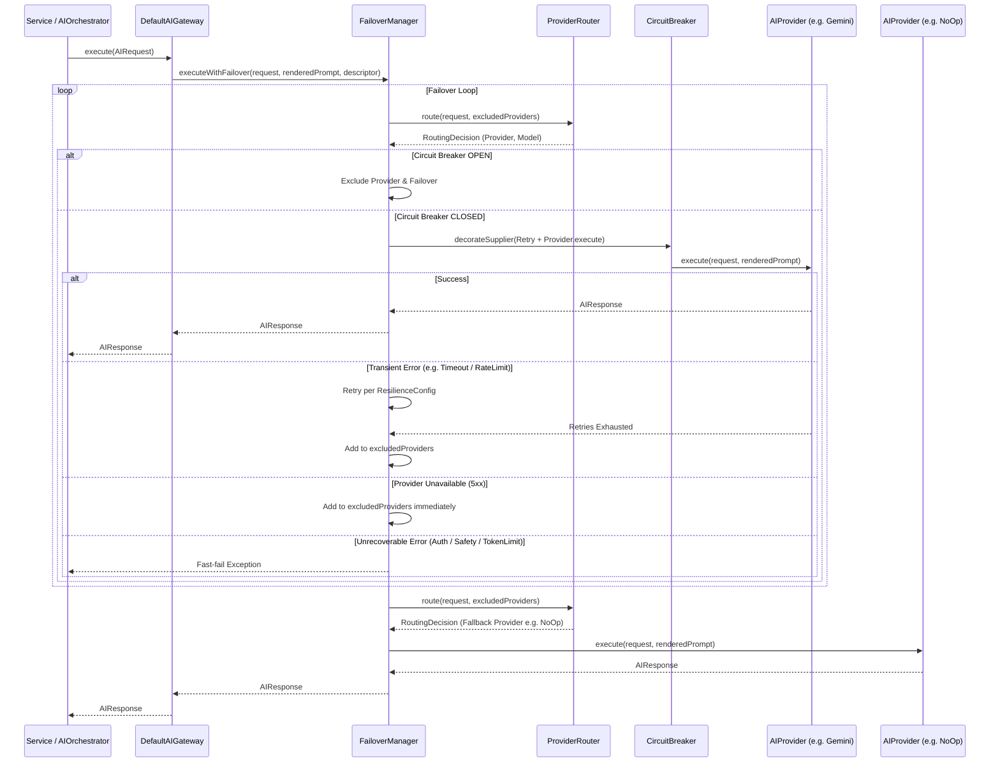
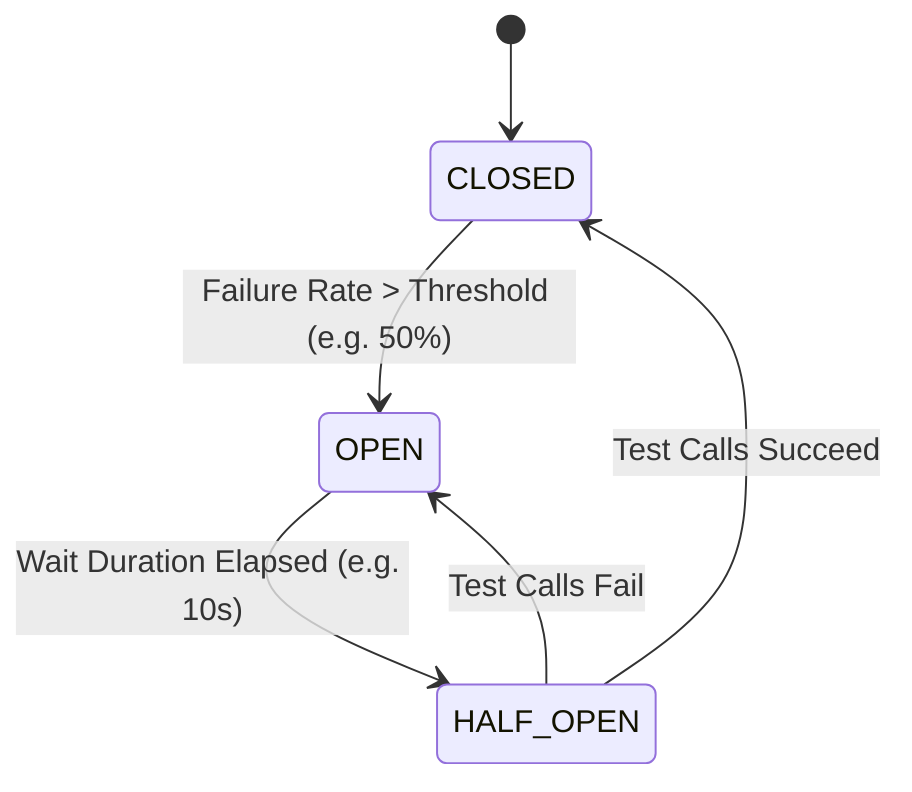

# Enterprise AI Resilience, Retry & Failover Architecture

This document specifies the resilience, fault-tolerance, and provider failover layer of the Vetra AI Platform (Stage 13.0.4).

## Overview

The AI layer must guarantee zero business-level disruption due to transient AI provider failures, API rate limits, network timeouts, or provider degradation. The `FailoverManager` sits between the pure orchestration `DefaultAIGateway` and the capability-based `ProviderRouter`, providing per-provider resilience and transparent fallback.

## Execution Flow



## Exception Taxonomy Routing Rules

Exception handling is strictly type-driven using the enterprise AI exception hierarchy:

| Exception Type | Strategy | Action |
| :--- | :--- | :--- |
| `AIAuthenticationException` | Fast-Fail | Throw immediately. Do not retry, do not failover. |
| `AISafetyViolationException` | Fast-Fail | Throw immediately. Do not retry, do not failover. |
| `AITokenLimitExceededException` | Fast-Fail | Throw immediately. Do not retry, do not failover. |
| `AIInvalidResponseException` | Retry -> Failover | Retry per provider config. If retries exhaust, exclude provider and failover. |
| `AITimeoutException` | Retry -> Failover | Exponential backoff retry. If retries exhaust, exclude provider and failover. |
| `AIRateLimitException` | Retry -> Failover | Exponential backoff retry. If retries exhaust, exclude provider and failover. |
| `AIProviderUnavailableException` | Immediate Failover | Skip retries on current provider. Add to excluded list and failover. |
| `CallNotPermittedException` | Circuit Open Failover | Skip execution. Add provider to excluded list and failover. |

## Circuit Breaker State Transitions

Each AI provider has an independent Resilience4j `CircuitBreaker` instance:



- **CLOSED**: Traffic flows normally. Failures are recorded against the sliding window.
- **OPEN**: Traffic is short-circuited. Calls immediately trigger `CallNotPermittedException`, causing `FailoverManager` to route to an alternative provider.
- **HALF_OPEN**: Permits a trial number of calls to test provider health after open state duration expires.

## Observability & Metrics

The resilience layer emits both Micrometer metrics and OpenTelemetry span events:

### Micrometer Metrics
- `ai_requests_total`: Total AI Gateway executions.
- `ai_retry_total`: Counter of retry attempts per provider.
- `ai_failover_total`: Counter of transparent failover transitions between providers.
- `ai_provider_errors_total`: Provider-level execution error count.
- `ai_circuit_open_total`: Incremented when a request encounters an OPEN circuit breaker.
- `ai_latency_seconds`: Latency timer per provider execution.

### OpenTelemetry Span Events
- `retry_attempt`: Recorded on the active span with provider name and attempt count.
- `circuit_breaker_open`: Recorded when circuit breaker short-circuits.
- `circuit_breaker_state_transition`: Recorded on state transitions (CLOSED -> OPEN -> HALF_OPEN).
- `provider_unavailable`: Recorded on 5xx or provider outages.

## Configuration Reference

Resilience parameters are specified per-provider under `vetra.ai.gateway.providers`:

```yaml
vetra:
  ai:
    gateway:
      enabled: true
      default-provider: gemini
      default-model: diagnostics-fast
      providers:
        - name: gemini
          enabled: true
          priority: 1
          resilience:
            max-retry-attempts: 3
            wait-duration: 500ms
            backoff-multiplier: 2.0
            circuit-breaker-failure-rate-threshold: 50
            circuit-breaker-wait-duration-in-open-state: 10s
            circuit-breaker-sliding-window-size: 10
            timeout: 10s
        - name: noop
          enabled: true
          priority: 99
          resilience:
            max-retry-attempts: 1
            wait-duration: 0ms
            circuit-breaker-failure-rate-threshold: 100
```
