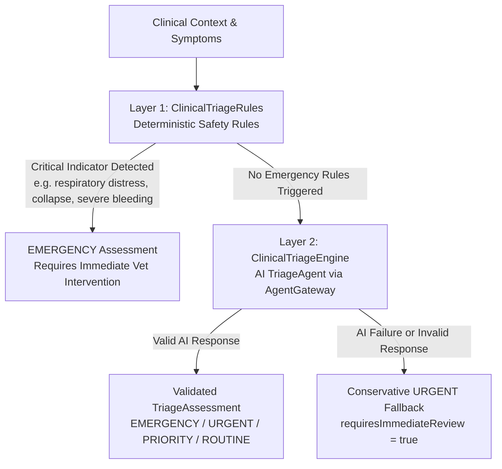

# Stage 13.1.2 — Enterprise Clinical Triage & Urgency Assessment Architecture

## Executive Summary

Stage 13.1.2 introduces **Enterprise Clinical Triage & Urgency Assessment** to the Vetra Clinical Intelligence module. Triage evaluates clinical observations, symptoms, visual findings, and disease candidates to answer:

> *"How urgently does this animal require professional veterinary attention?"*

The underlying **AI Platform v1.1 execution pipeline** (`DefaultAIGateway` → `AIGovernancePipeline` → `AICacheManager` → `FailoverManager` → `ProviderRouter` → `AIProvider`) and **Multi-Agent Framework** (`AgentGateway` → `AgentRegistry` → `AIAgent`) remain **100% frozen, immutable, and preserved**.

---

## 1. 2-Layer Safety-First Architecture

Triage uses a strict 2-layer safety evaluation model:

### Safety Precedence Rules
1. **Deterministic Rule Precedence**: If a Layer 1 critical indicator triggers (respiratory distress, severe bleeding, seizures, collapse), the system immediately returns `EMERGENCY` without invoking `TriageAgent` or `AgentGateway`.
2. **Negation Precedence**: Symptoms with negating prefixes (e.g. *"no respiratory distress"*, *"denies collapse"*, *"without bleeding"*) do **NOT** trigger emergency rules.
3. **Severe Disease vs Current Indicators**: High-severity disease candidates alone do not automatically trigger an emergency; classification depends on the animal's observed clinical indicators.
4. **Conservative Fallback Policy**: If AI reasoning fails or produces malformed JSON without a deterministic emergency, the engine returns a conservative `URGENT` assessment with `requiresImmediateVeterinaryReview = true` rather than defaulting to `ROUTINE`.

---

## 2. Standardized Urgency Levels

| Level | Definition | Escalation Action |
| :--- | :--- | :--- |
| **`EMERGENCY`** | Critical risk to life/welfare. | Seek immediate emergency veterinary intervention without delay. |
| **`URGENT`** | Significant risk requiring prompt assessment. | Contact veterinarian as soon as possible (preferably within hours). |
| **`PRIORITY`** | Moderate risk requiring short-term assessment. | Schedule veterinary examination within an appropriate short timeframe. |
| **`ROUTINE`** | Non-urgent clinical case. | Continue standard monitoring and routine care. |

---

## 3. Workflow Integration (Order 4)

`ClinicalTriageStep` executes at Order 4 in the clinical diagnosis pipeline:

1. **`DiagnosisStep`** (Order 1) → Visual pathology & anomaly detection.
2. **`KnowledgeStep`** (Order 2) → Grounded literature retrieval (RAG).
3. **`RankingStep`** (Order 3) → Disease candidate ranking & confidence normalization.
4. **`ClinicalTriageStep`** (Order 4) → Deterministic rules + AI Triage assessment.
5. **`TreatmentStep`** (Order 5) → Treatment protocols respecting triage urgency.
6. **`ReportStep`** (Order 6) → Synthesis of `ClinicalDiagnosisReport` with Triage section.

---

## 4. Telemetry & Observability

### Micrometer Metrics
- **`clinical_triage_total`**: Counter tracking total triage assessments by `urgency` and `status`.
- **`clinical_triage_duration_seconds`**: Timer tracking triage execution duration.
- **`clinical_triage_urgency_total`**: Counter tracking assessments by urgency level.
- **`clinical_triage_escalations_total`**: Counter tracking `URGENT` and `EMERGENCY` escalations.

### OpenTelemetry Span Events
- `triage.started`
- `triage.completed`
- `triage.emergency`
- `triage.escalation_required`
