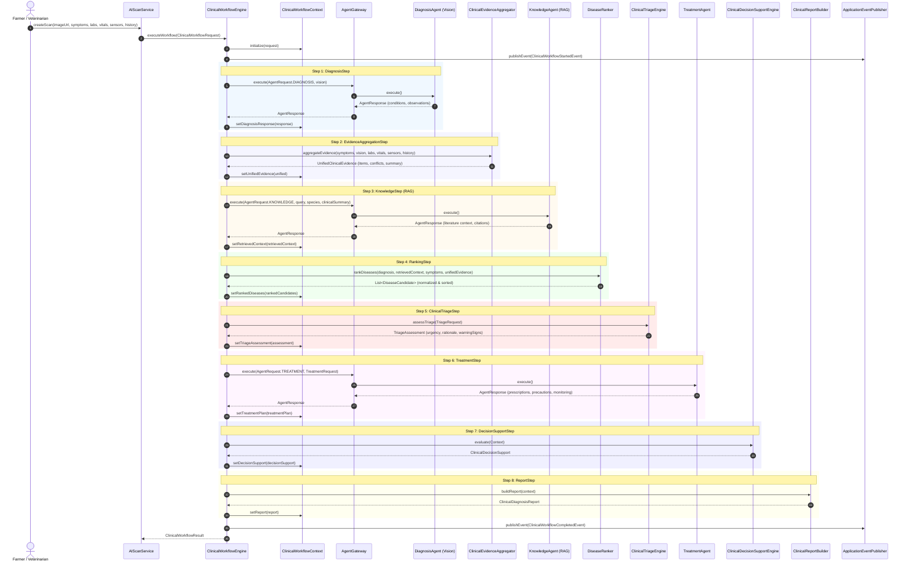

# Stage 13.1.1 — Enterprise Clinical Diagnosis Workflow Architecture

## Executive Summary

Stage 13.1.1 establishes the **Enterprise Clinical Diagnosis Workflow** layer in Vetra AI Platform v1.1. Stage 13.1.4 extends this workflow to an 8-step multi-modal intelligence & explainability pipeline.

The underlying **AI Platform v1.1 execution pipeline** (`DefaultAIGateway` → `AIGovernancePipeline` → `AICacheManager` → `FailoverManager` → `ProviderRouter` → `AIProvider`) and the **Multi-Agent Framework** (`AgentGateway` → `AgentRegistry` → `AIAgent`) remain **100% frozen, immutable, and preserved**.

---

## 1. 8-Step Multi-Modal Workflow Sequence

---

## 2. Component Responsibilities

| Component | Layer / Package | Primary Responsibility |
| :--- | :--- | :--- |
| **`ClinicalWorkflowEngine`** | `app.vetra.ai.workflow.clinical` | Orchestrates polymorphic `WorkflowStep` components in order over a shared `ClinicalWorkflowContext`. |
| **`WorkflowStep`** | `app.vetra.ai.workflow.clinical.step` | Step abstraction enabling decoupled, testable, and parallelizable stages. |
| **`DiagnosisStep`** | `app.vetra.ai.workflow.clinical.step` | Step 1: Dispatches visual pathology and anomaly detection via `DiagnosisAgent`. |
| **`EvidenceAggregationStep`** | `app.vetra.ai.workflow.clinical.step` | Step 2: Normalizes multi-modal data streams, detects measurement conflicts, and produces `UnifiedClinicalEvidence`. |
| **`KnowledgeStep`** | `app.vetra.ai.workflow.clinical.step` | Step 3: Executes RAG retrieval via `KnowledgeAgent` using controlled clinical evidence summaries. |
| **`RankingStep`** | `app.vetra.ai.workflow.clinical.step` | Step 4: Invokes multi-modal `DiseaseRanker` with dynamic weight normalization across active modalities. |
| **`ClinicalTriageStep`** | `app.vetra.ai.workflow.clinical.step` | Step 5: Assesses case urgency via Layer 1 deterministic safety rules and Layer 2 `TriageAgent`. |
| **`TreatmentStep`** | `app.vetra.ai.workflow.clinical.step` | Step 6: Dispatches evidence-based treatment regimens via `TreatmentAgent`. |
| **`DecisionSupportStep`** | `app.vetra.ai.workflow.clinical.step` | Step 7: Deterministically synthesizes `ClinicalDecisionSupport`, evidence traceability, uncertainty, and vet review flags. |
| **`ReportStep`** | `app.vetra.ai.workflow.clinical.step` | Step 8: Invokes `ClinicalReportBuilder` to assemble the structured `ClinicalDiagnosisReport` with `ClinicalDecisionSupport`. |
| **`DiseaseRanker`** | `app.vetra.ai.workflow.clinical` | Multi-modal weighted candidate ranking with active modality normalization. |
| **`ClinicalTriageEngine`** | `app.vetra.ai.workflow.clinical.triage` | Evaluates deterministic safety rules + AI reasoning for urgency classification. |
| **`ClinicalDecisionSupportEngine`** | `app.vetra.ai.workflow.clinical.explainability` | Deterministic synthesis of evidence traceability, triage trigger explanation, uncertainty, and review flags. |
| **`ClinicalReportBuilder`** | `app.vetra.ai.workflow.clinical` | Pure report assembly component synthesizing outputs without containing business logic. |
| **`ClinicalWorkflowEventListener`** | `app.vetra.ai.workflow.clinical` | Asynchronous decoupled listener for workflow lifecycle domain events. |
