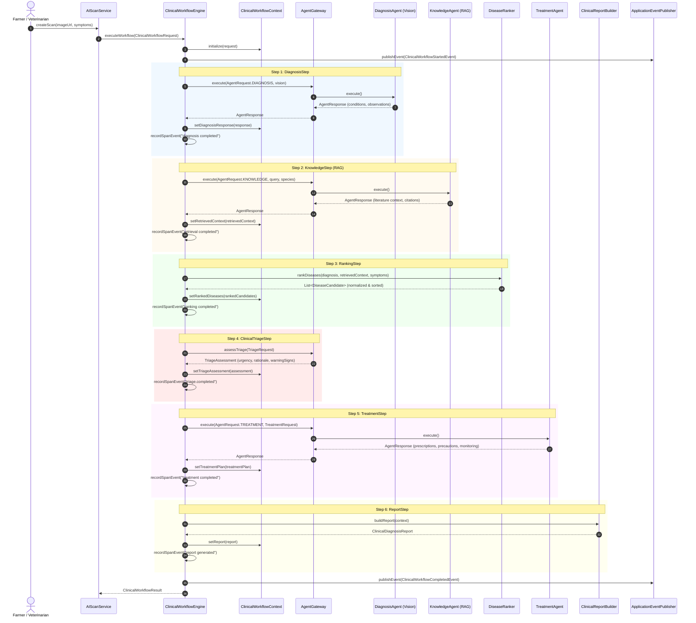

# Stage 13.1.1 — Enterprise Clinical Diagnosis Workflow Architecture

## Executive Summary

Stage 13.1.1 establishes the **Enterprise Clinical Diagnosis Workflow** layer in Vetra AI Platform v1.1. It shifts the platform from single-request execution to an end-to-end multi-agent clinical pipeline that produces complete, veterinarian-ready clinical diagnosis reports.

The underlying **AI Platform v1.1 execution pipeline** (`DefaultAIGateway` → `AIGovernancePipeline` → `AICacheManager` → `FailoverManager` → `ProviderRouter` → `AIProvider`) and the **Multi-Agent Framework** (`AgentGateway` → `AgentRegistry` → `AIAgent`) remain **100% frozen, immutable, and preserved**.

---

## 1. Sequence Diagram

---

## 2. Component Responsibilities

| Component | Layer / Package | Primary Responsibility |
| :--- | :--- | :--- |
| **`ClinicalWorkflowEngine`** | `app.vetra.ai.workflow.clinical` | Orchestrates polymorphic `WorkflowStep` components in order over a shared `ClinicalWorkflowContext`. |
| **`WorkflowStep`** | `app.vetra.ai.workflow.clinical.step` | Step abstraction enabling decoupled, testable, and parallelizable stages. |
| **`DiagnosisStep`** | `app.vetra.ai.workflow.clinical.step` | Step 1: Dispatches visual pathology and anomaly detection via `DiagnosisAgent`. |
| **`KnowledgeStep`** | `app.vetra.ai.workflow.clinical.step` | Step 2: Executes RAG retrieval via `KnowledgeAgent` with species metadata filtering. |
| **`RankingStep`** | `app.vetra.ai.workflow.clinical.step` | Step 3: Invokes `DiseaseRanker` to merge observations, normalize confidence scores, and deduplicate conditions. |
| **`ClinicalTriageStep`** | `app.vetra.ai.workflow.clinical.step` | Step 4: Assesses case urgency via Layer 1 deterministic safety rules and Layer 2 `TriageAgent`. |
| **`TreatmentStep`** | `app.vetra.ai.workflow.clinical.step` | Step 5: Dispatches evidence-based treatment regimens via `TreatmentAgent`. |
| **`ReportStep`** | `app.vetra.ai.workflow.clinical.step` | Step 6: Invokes `ClinicalReportBuilder` to assemble the structured `ClinicalDiagnosisReport`. |
| **`DiseaseRanker`** | `app.vetra.ai.workflow.clinical` | Merges visual diagnosis with literature citations and normalizes scores to `[0.00, 1.00]`. |
| **`ClinicalTriageEngine`** | `app.vetra.ai.workflow.clinical.triage` | Evaluates deterministic safety rules + AI reasoning for urgency classification. |
| **`ClinicalReportBuilder`** | `app.vetra.ai.workflow.clinical` | Pure report assembly component synthesizing outputs without containing business logic. |
| **`ClinicalWorkflowEventListener`** | `app.vetra.ai.workflow.clinical` | Asynchronous decoupled listener for workflow lifecycle domain events. |

---

## 3. Workflow Context & Data Models

### `ClinicalWorkflowContext`
The stateful context carrying intermediate state across the lifecycle:
- `request`: Input `ClinicalWorkflowRequest` (`scanId`, `animalId`, `imageUrl`, `species`, `symptoms`).
- `diagnosisResponse`: Raw visual output and condition observations.
- `retrievedContext`: Grounded veterinary text and structured `Citation` records from RAG.
- `rankedDiseases`: Sorted list of `DiseaseCandidate` records.
- `treatmentPlan`: Synthesized medications, dosage, biosecurity precautions, and monitoring guidance.
- `report`: Final `ClinicalDiagnosisReport`.
- `stepTimings`: Granular execution latency recorded per stage.
- `status`: `WorkflowStatus` (`RUNNING`, `SUCCESS`, `PARTIAL`, `FAILED`).

---

## 4. Observability & Low-Cardinality Telemetry

### Micrometer Metrics
- **`clinical_workflow_total`**: Counter tracking workflows by status (`SUCCESS`, `PARTIAL`, `FAILED`).
- **`clinical_workflow_duration_seconds`**: Latency SLA timer publishing percentiles (`p50`, `p95`, `p99`).
- **`disease_ranking_total`**: Counter tracking disease ranking executions.
- **`treatment_generation_total`**: Counter tracking treatment plan generations.

### OpenTelemetry Span Events
The workflow enriches the active span with canonical span events:
- `diagnosis completed`
- `retrieval completed`
- `ranking completed`
- `treatment completed`
- `report generated`

---

## 5. Future Extension Points

1. **Stage 13.1.2 — Automated Clinical Triage**:
   - Introduce `TriageStep` to calculate urgency index and trigger emergency SMS/push alerts.
2. **Stage 13.1.3 — Multi-Modal Lab & Sensor Integration**:
   - Extend `ClinicalWorkflowContext` with blood panel and IoT sensor telemetry (temperature, rumination rate).
3. **Parallel Step Execution**:
   - Independent steps (e.g. `DiagnosisStep` and preliminary `KnowledgeStep`) can execute concurrently via `CompletableFuture` without architectural modifications.
