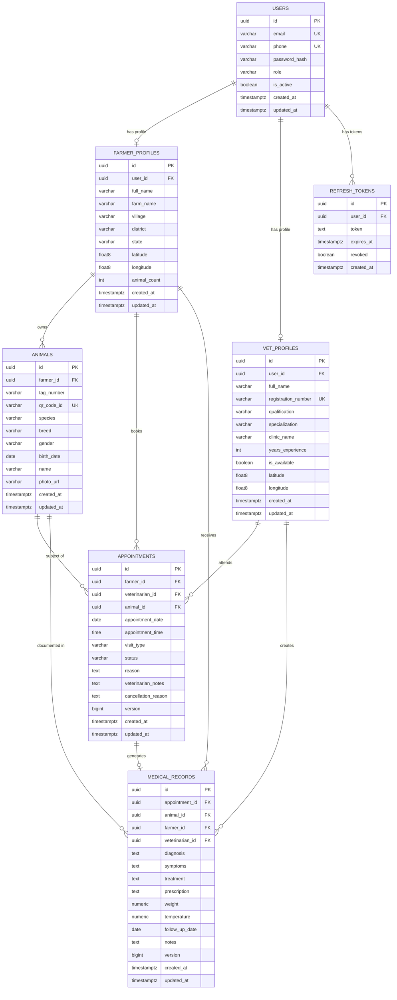

# Entity Relationship Diagram (ERD)
**Document ID:** DATA-05  
**Status:** Active  
**Last Updated:** 2026-07-29  
**Applies To:** `omrajput14/vetra-backend`  
**References:** [Database Design](./04-database-design.md), [Domain Model](../domain/03-domain-model.md)

---

## Overview

This document provides the Entity Relationship Diagram for the Vetra PostgreSQL database, covering all tables from Flyway migrations V1 through V6.

---

## Entity Relationship Diagram

---

## Relationship Descriptions

### USERS → FARMER_PROFILES / VET_PROFILES (One-to-One)

A `USERS` record is the authentication identity. Every user has exactly one role (`FARMER` or `VET`) and exactly one corresponding profile. Profiles are created atomically during registration (same transaction as user creation).

**Delete behavior:** `ON DELETE CASCADE` — deleting a user deletes their profile.

---

### USERS → REFRESH_TOKENS (One-to-Many)

A user may have multiple refresh tokens (one per device/session). Tokens are revoked on logout or invalidated on password change. Expired tokens are candidates for pruning.

---

### FARMER_PROFILES → ANIMALS (One-to-Many)

A farmer owns zero or more animals. When a farmer's profile is deleted (which cascades from user deletion), all their animals are deleted.

**Business Rule:** An animal cannot be transferred between farmers in the current implementation. Transfer ownership is planned for a future stage.

---

### FARMER_PROFILES + VET_PROFILES + ANIMALS → APPOINTMENTS (Many-to-One from each)

An appointment is the intersection of a farmer, a veterinarian, and a specific animal. All three foreign keys are required and non-nullable.

**Note:** The appointment belongs to one farmer, one veterinarian, and one animal. There is no many-to-many junction table — the appointment itself is the relationship.

---

### APPOINTMENTS → MEDICAL_RECORDS (One-to-One)

A completed appointment may generate exactly one medical record. `appointment_id` is `UNIQUE` in `medical_records`, enforcing this constraint at the database level.

**Business Rule:** A medical record can only be created once a corresponding appointment has `status = COMPLETED`.

---

### ANIMALS → MEDICAL_RECORDS (One-to-Many)

An animal accumulates medical records over its lifetime. The collection of all records for an animal constitutes its medical history (EVMR timeline).

---

## Cascade Delete Map

| Delete Event | Cascades To |
|---|---|
| `DELETE FROM users` | `farmer_profiles`, `vet_profiles`, `refresh_tokens` |
| `DELETE FROM farmer_profiles` | `animals`, `appointments` (farmer side), `medical_records` (farmer side) |
| `DELETE FROM animals` | `appointments` (animal side), `medical_records` (animal side) |
| `DELETE FROM appointments` | `medical_records` |

> [!CAUTION]
> Deleting a `users` record is a destructive operation that cascades through the entire user data hierarchy. In production, users should be soft-deleted (`is_active = FALSE`) rather than hard-deleted. Hard delete should only be used for regulatory data erasure requests.

---

## Cardinality Summary

| Relationship | Cardinality |
|---|---|
| User → FarmerProfile | 1:0..1 |
| User → VetProfile | 1:0..1 |
| User → RefreshTokens | 1:0..N |
| FarmerProfile → Animals | 1:0..N |
| FarmerProfile → Appointments | 1:0..N |
| VetProfile → Appointments | 1:0..N |
| Animal → Appointments | 1:0..N |
| Appointment → MedicalRecord | 1:0..1 (max 1) |
| Animal → MedicalRecords | 1:0..N |
