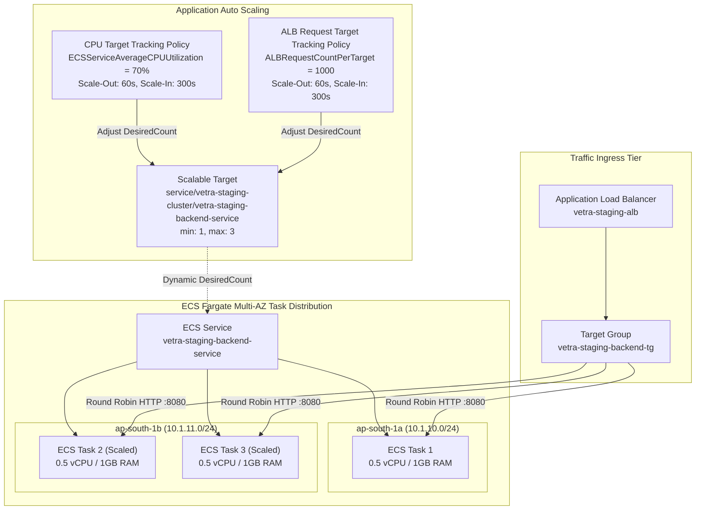

# Stage 14.11 — ECS Fargate Application Auto Scaling & Resiliency Manual

**Document ID:** OPS-14.11  
**Environment:** Staging / Pre-Production  
**Applies To:** AWS ECS Fargate, Application Load Balancer, AWS Application Auto Scaling  
**Status:** Staging Active  
**Last Updated:** August 2026  

---

## 1. Overview & Architecture

Stage 14.11 establishes elastic horizontal auto-scaling and multi-AZ fault tolerance for the Vetra staging backend on AWS ECS Fargate using AWS Application Auto Scaling.



---

## 2. Auto-Scaling Policy Specifications

| Parameter | Configuration | Technical Rationale |
|---|---|---|
| **Service Namespace** | `ecs` | Governs ECS service task instance scaling. |
| **Scalable Dimension** | `ecs:service:DesiredCount` | Adjusts active Fargate task count. |
| **Minimum Capacity** | `1` task | Base staging idle capacity ($\approx \$17.70/\text{mo}$). |
| **Maximum Capacity** | `3` tasks | Strict ceiling to protect staging RDS `db.t4g.micro` connection pool. |
| **CPU Target Tracking** | `70.0%` average CPU | Scales out if compute-intensive requests (e.g., bcrypt / JWT) spike CPU. |
| **ALB Request Target Tracking** | `1000 requests/target` | Scales out if request throughput increases on fast/cached endpoints. |
| **Scale-Out Cooldown** | `60 seconds` | Rapid responsiveness to incoming traffic surges. |
| **Scale-In Cooldown** | `300 seconds` (5 min) | Prevents thrashing / flapping during transient traffic dips. |

---

## 3. Dual Policy Scale-Out vs. Scale-In Dynamics

AWS Application Auto Scaling evaluates both target tracking policies independently every 1 minute:

1. **Scale-Out (Eager):**
   * Auto Scaling calculates the required capacity for both policies.
   * Desired count is set to $\max(\text{Desired}_{\text{CPU}}, \text{Desired}_{\text{Req}})$.
   * If either metric breaches the threshold, scale-out occurs within 60 seconds.
2. **Scale-In (Conservative):**
   * Auto Scaling will only reduce capacity when **both** policies indicate that capacity can be safely lowered.
   * Auto Scaling scales in to the **highest** recommended capacity between the policies.
   * Held back by `scale_in_cooldown = 300` seconds to guarantee graceful request draining.

---

## 4. Multi-AZ Task Placement & Fargate Constraints

* **Fargate Architecture Constraint:** AWS Fargate abstracts underlying EC2 infrastructure and does **not** support explicit `ordered_placement_strategy` (such as `binpack` or `spread`) or `placement_constraints`.
* **Subnet Round-Robin:** Because the ECS service is configured with private subnets across two AZs (`10.1.10.0/24` in `ap-south-1a` and `10.1.11.0/24` in `ap-south-1b`), the AWS Fargate scheduler automatically distributes task instances evenly across these subnets when scaling from 1 to 2 or 3 tasks.
* **Target Group Connection Draining:** ALB deregistration delay is configured at `30 seconds` (`deregistration_delay.timeout_seconds = 30`), allowing in-flight HTTP requests to complete before scaled-in tasks are terminated.

---

## 5. Capacity & Resource Headroom

### PostgreSQL (`db.t4g.micro`) Connection Safety
* **RDS PostgreSQL Max Connections:** Calculated by PostgreSQL as $\text{LEAST}(\text{RAM} / 9531392, 5000) \approx \mathbf{112\text{ connections}}$.
* **HikariCP Configuration:** `maximum-pool-size = 30`, `minimum-idle = 10` per container.
* **Connection Headroom:**
  * 1 Task: $1 \times 30 = 30$ peak connections (27% pool usage).
  * 2 Tasks: $2 \times 30 = 60$ peak connections (53% pool usage).
  * 3 Tasks: $3 \times 30 = 90$ peak connections (80% pool usage).
  * 22 connections remain reserved for Flyway migrations, admin sessions, and monitoring queries.

---

## 6. Operational Runbook & Emergency Overrides

### Checking Current Auto-Scaling State
```bash
# View registered scalable target
aws application-autoscaling describe-scalable-targets \
  --service-namespace ecs \
  --region ap-south-1

# View active scaling policies
aws application-autoscaling describe-scaling-policies \
  --service-namespace ecs \
  --region ap-south-1
```

### Manual Capacity Override (Emergency Scaling)
If an emergency requires pinning the service to a fixed number of tasks without removing the autoscaler:
```bash
aws application-autoscaling register-scalable-target \
  --service-namespace ecs \
  --resource-id service/vetra-staging-cluster/vetra-staging-backend-service \
  --scalable-dimension ecs:service:DesiredCount \
  --min-capacity 2 \
  --max-capacity 2 \
  --region ap-south-1
```
