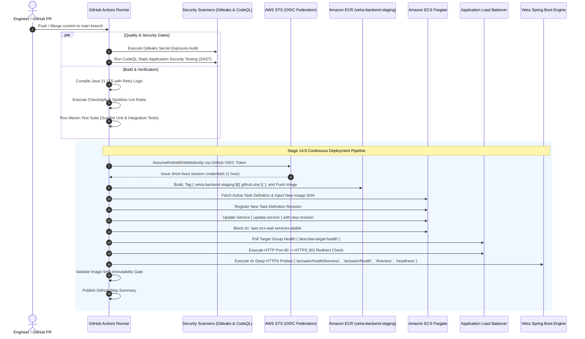

# Stage 14.9 — Continuous Deployment Pipeline & Health Verification Manual

**Document ID:** OPS-14.9  
**Environment:** Staging / Pre-Production (`ap-south-1`)  
**Applies To:** GitHub Actions CI/CD, AWS ECR, AWS ECS Fargate, AWS ALB, ACM HTTPS  
**Status:** Live & Production-Hardened  
**Last Updated:** August 2026  

---

## 1. Executive Summary & Overview

Stage 14.9 establishes a fully automated, keyless Continuous Integration and Continuous Deployment (CI/CD) pipeline for the **Vetra Backend** on AWS. Every push to the `main` branch undergoes rigorous automated quality, security, and integration gates before triggering an automated, zero-downtime rolling deployment to AWS ECS Fargate.

The deployment pipeline integrates seamlessly with:
- **Keyless AWS STS Authentication:** Using GitHub OpenID Connect (OIDC) identity federation without static IAM credentials.
- **Immutable Container Artifacts:** Docker images tagged exclusively by the full Git commit SHA (`vetra-backend-staging:<sha>`).
- **Dynamic Task Definition Revisions:** Automatically extracting and registering new task definitions while strictly preserving AWS Secrets Manager ARNs and runtime environment variables.
- **Zero-Downtime Rolling Updates:** Managed by AWS ECS Fargate with deployment circuit breakers and automatic rollback.
- **Hardened Multi-Tier Health Probing:** Validating target group health, HTTP Port 80 $\rightarrow$ HTTPS Port 443 (301) redirect, and 4 distinct deep health probes across the live custom domain (`api.vetra.dpdns.org`).

---

## 2. CI/CD Architecture & Workflow



---

## 3. Pipeline Stage Specifications

### 3.1. Continuous Integration (CI) Quality Gates

| Job Name | Primary Actions | Failure Conditions |
|---|---|---|
| `gitleaks` | Scans git history for hardcoded secrets, private keys, or credentials. | Any high-entropy credential pattern detected. |
| `codeql` | Runs GitHub CodeQL semantic security scanning on Java sources. | High/Critical CWE vulnerabilities detected. |
| `build-and-test` | Builds Maven package with Temurin OpenJDK 21, enforces Checkstyle, runs JUnit 5 tests. | Compilation failure, formatting drift, test failure. |

### 3.2. Container Packaging & ECR Publishing

- **Docker Multi-Stage Build:** Uses lightweight Alpine OpenJDK 21 runtime running under non-root user `vetra:vetra` (UID/GID 10001).
- **ECR Repository:** `278177225155.dkr.ecr.ap-south-1.amazonaws.com/vetra-backend-staging`
- **Tagging Strategy:**
  - `vetra-backend-staging:${{ github.sha }}` (Immutable Primary Release Tag)
  - `vetra-backend-staging:latest` (Convenience Pointer)
- **ECR Lifecycle Policy:** Retains only the last 10 untagged images and 30 tagged deployment images to manage storage overhead.

### 3.3. Keyless AWS OIDC Authentication

GitHub Actions authenticates to AWS using an IAM Role configured with OpenID Connect (OIDC) trust policy:
- **Role ARN:** `arn:aws:iam::278177225155:role/vetra-staging-github-actions-deploy-role`
- **Trust Condition:** Restricted to `repo:omrajput14/vetra-backend:ref:refs/heads/main`
- **Session Duration:** 3600 seconds (temporary, short-lived tokens automatically invalidated).

### 3.4. Dynamic ECS Task Registration & Rolling Update

The workflow renders new task definition revisions on the fly using `jq` without altering sensitive runtime configurations:
1. Queries current task definition for `vetra-staging-backend`.
2. Replaces `containerDefinitions[0].image` with the newly pushed commit SHA.
3. Preserves all container CPU/memory allocations (512 / 1024), environment variables, and Secrets Manager ARNs (`DB_PASSWORD`, `REDIS_PASSWORD`, `JWT_SECRET`).
4. Invokes `aws ecs register-task-definition` and captures the new revision ARN.
5. Invokes `aws ecs update-service --cluster vetra-staging-cluster --service vetra-staging-backend-service --task-definition <NEW_ARN>`.

---

## 4. Health Verification & Smoke Test Matrix

The deployment pipeline enforces a strict 5-point verification matrix using the live canonical domain `api.vetra.dpdns.org`. If any check fails, the deployment job fails immediately with `set -euo pipefail`.

```
┌────────────────────────────────────────────────────────────────────────────────────────┐
│                          STAGE 14.9 LIVE SMOKE TEST MATRIX                            │
├────┬─────────────────────────────┬──────────┬──────────────┬───────────────────────────┤
│ #  │ Target Probe Endpoint       │ Protocol │ Expected Code│ Verification Requirement  │
├────┼─────────────────────────────┼──────────┼──────────────┼───────────────────────────┤
│ 1  │ http://api.vetra.dpdns.org  │ HTTP:80  │ 301 Moved    │ Location header points to │
│    │ /actuator/health            │          │ Permanently  │ https://api.vetra.dpdns...│
├────┼─────────────────────────────┼──────────┼──────────────┼───────────────────────────┤
│ 2  │ https://api.vetra.dpdns.org │ HTTPS:443│ 200 OK       │ Spring Boot container is  │
│    │ /actuator/health/liveness   │          │              │ alive & handling requests │
├────┼─────────────────────────────┼──────────┼──────────────┼───────────────────────────┤
│ 3  │ https://api.vetra.dpdns.org │ HTTPS:443│ 200 OK       │ RDS PostgreSQL + Redis TLS│
│    │ /actuator/health            │          │              │ connections are healthy   │
├────┼─────────────────────────────┼──────────┼──────────────┼───────────────────────────┤
│ 4  │ https://api.vetra.dpdns.org │ HTTPS:443│ 200 OK       │ Application layer liveness│
│    │ /liveness                   │          │              │ probe responds            │
├────┼─────────────────────────────┼──────────┼──────────────┼───────────────────────────┤
│ 5  │ https://api.vetra.dpdns.org │ HTTPS:443│ 200 OK       │ Application layer readiness│
│    │ /readiness                  │          │              │ probe responds            │
└────┴─────────────────────────────┴──────────┴──────────────┴───────────────────────────┘
```

### Smoke Test Script Implementation

```bash
set -euo pipefail
API_URL="https://api.vetra.dpdns.org"
HTTP_URL="http://api.vetra.dpdns.org"
echo "Executing smoke tests against $API_URL and redirect tests against $HTTP_URL..."

# 1. Probe HTTP -> HTTPS 301 Redirect
HEADER_DUMP=$(curl -sS -D - -o /dev/null "$HTTP_URL/actuator/health")
HTTP_STATUS=$(echo "$HEADER_DUMP" | grep -i "^HTTP/" | tail -n 1 | awk '{print $2}')
LOCATION_HEADER=$(echo "$HEADER_DUMP" | grep -i "^Location:" | tr -d '\r' | awk '{print $2}')

if [ "$HTTP_STATUS" != "301" ]; then
  echo "::error::HTTP Port 80 redirect failed. Expected 301, got $HTTP_STATUS"
  exit 1
fi
if [[ ! "$LOCATION_HEADER" =~ ^https://api\.vetra\.dpdns\.org ]]; then
  echo "::error::Redirect Location header does not point to https://api.vetra.dpdns.org. Got $LOCATION_HEADER"
  exit 1
fi

# 2. Probe /actuator/health/liveness over HTTPS
LIVENESS_RESP=$(curl -sS -o /dev/null -w "%{http_code}" "$API_URL/actuator/health/liveness")
test "$LIVENESS_RESP" = "200"

# 3. Probe /actuator/health over HTTPS (DB + Redis TLS)
HEALTH_RESP=$(curl -sS -o /dev/null -w "%{http_code}" "$API_URL/actuator/health")
test "$HEALTH_RESP" = "200"

# 4. Probe /liveness over HTTPS
APP_LIVENESS_RESP=$(curl -sS -o /dev/null -w "%{http_code}" "$API_URL/liveness")
test "$APP_LIVENESS_RESP" = "200"

# 5. Probe /readiness over HTTPS
APP_READINESS_RESP=$(curl -sS -o /dev/null -w "%{http_code}" "$API_URL/readiness")
test "$APP_READINESS_RESP" = "200"
```

---

## 5. Rollback Strategy & Emergency Runbook

### Automatic Circuit Breaker Rollback
The ECS service is provisioned with `deploymentCircuitBreaker` enabled with `rollback = true`.
- If newly launched tasks crash during startup or fail the ALB health check, ECS automatically terminates the deployment and rolls back the service to the previous active task definition revision without operator intervention.

### Manual Immediate Rollback via AWS CLI

If an application-level bug escapes smoke testing, roll back immediately to a known-stable task definition revision:

```bash
# 1. List the most recent task definition revisions
aws ecs list-task-definitions \
  --family-prefix vetra-staging-backend \
  --sort DESC \
  --region ap-south-1

# 2. Re-point the ECS service to the previous stable revision (e.g. revision 4)
aws ecs update-service \
  --cluster vetra-staging-cluster \
  --service vetra-staging-backend-service \
  --task-definition vetra-staging-backend:4 \
  --region ap-south-1

# 3. Wait for stability
aws ecs wait services-stable \
  --cluster vetra-staging-cluster \
  --service vetra-staging-backend-service \
  --region ap-south-1
```

---

## 6. Verification Checklist

- [x] Keyless AWS OIDC authentication confirmed with zero static secrets stored in GitHub Actions.
- [x] ECR image tag immutability verified against commit SHA `${{ github.sha }}`.
- [x] Rolling deployment confirmed with zero downtime on `vetra-staging-backend-service`.
- [x] Port 80 HTTP $\rightarrow$ Port 443 HTTPS 301 redirection validated with correct `Location` header.
- [x] End-to-end HTTPS health probes verified on `https://api.vetra.dpdns.org`.
- [x] ECS task definition and desired count protected from Terraform state drift via lifecycle rules.
