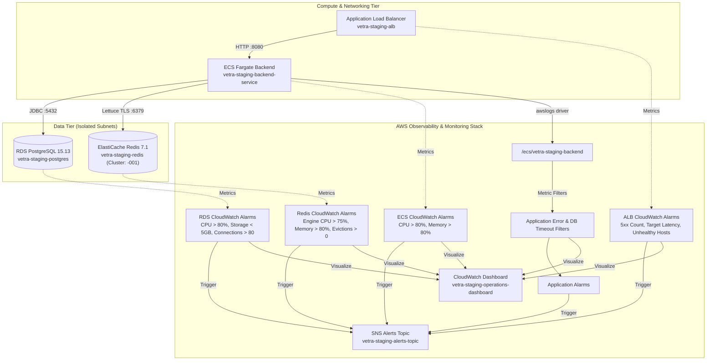

# Stage 14.10 — AWS CloudWatch Observability & Monitoring Manual

**Document ID:** OPS-14.10  
**Environment:** Staging / Pre-Production  
**Applies To:** AWS ECS Fargate, Application Load Balancer, RDS PostgreSQL 15.13/15.17, ElastiCache Redis 7.1, CloudWatch Logs  
**Status:** Staging Active  
**Last Updated:** August 2026  

---

## 1. Overview & Architecture

Stage 14.10 implements a complete, native CloudWatch observability suite across all compute, networking, data, and log layers of the Vetra staging environment without impacting application runtime performance or modifying security boundaries.



---

## 2. CloudWatch Alarms Catalog

All alarms route state changes to the SNS Alert Topic (`vetra-staging-alerts-topic`).

| Alarm Name | Layer | Metric & Dimension | Threshold / Condition | Evaluation Period | Severity | Runbook / Action |
|---|---|---|---|---|---|---|
| `vetra-staging-ecs-cpu-high` | Compute | `AWS/ECS:CPUUtilization` (`ClusterName`, `ServiceName`) | `>= 80%` | 2 × 60s (2 min) | High | Scale tasks / investigate CPU profile |
| `vetra-staging-ecs-memory-high` | Compute | `AWS/ECS:MemoryUtilization` (`ClusterName`, `ServiceName`) | `>= 80%` | 2 × 60s (2 min) | High | Check heap allocation / memory leak |
| `vetra-staging-alb-target-5xx-high` | Networking | `AWS/ApplicationELB:HTTPCode_Target_5XX_Count` (`LoadBalancer`, `TargetGroup`) | `>= 5` | 1 × 60s (1 min) | Critical | Investigate application exceptions / logs |
| `vetra-staging-alb-target-response-time-high` | Networking | `AWS/ApplicationELB:TargetResponseTime` (`LoadBalancer`, `TargetGroup`) | `p95 >= 2.0s` | 2 × 60s (2 min) | Medium | Check slow queries / Redis latency |
| `vetra-staging-alb-unhealthy-hosts` | Networking | `AWS/ApplicationELB:UnHealthyHostCount` (`LoadBalancer`, `TargetGroup`) | `>= 1` | 3 × 60s (3 min) | Critical | Inspect task liveness & readiness probes (3m evaluation prevents false deployment alerts) |
| `vetra-staging-rds-cpu-high` | Database | `AWS/RDS:CPUUtilization` (`DBInstanceIdentifier`) | `>= 80%` | 2 × 300s (10 min) | High | Identify unindexed or expensive queries |
| `vetra-staging-rds-storage-low` | Database | `AWS/RDS:FreeStorageSpace` (`DBInstanceIdentifier`) | `<= 5 GB` | 1 × 300s (5 min) | Critical | Expand RDS allocated storage volume (20GB initial) |
| `vetra-staging-rds-connections-high` | Database | `AWS/RDS:DatabaseConnections` (`DBInstanceIdentifier`) | `>= 80` | 2 × 300s (10 min) | High | Check HikariCP connection pool leaks (`db.t4g.micro`) |
| `vetra-staging-redis-engine-cpu-high` | Cache | `AWS/ElastiCache:EngineCPUUtilization` (`CacheClusterId = vetra-staging-redis-001`) | `>= 75%` | 2 × 300s (10 min) | High | Review slow Redis commands (`SLOWLOG`) |
| `vetra-staging-redis-memory-high` | Cache | `AWS/ElastiCache:DatabaseMemoryUsagePercentage` (`CacheClusterId = vetra-staging-redis-001`) | `>= 80%` | 2 × 300s (10 min) | High | Review key TTLs & eviction policies |
| `vetra-staging-redis-evictions` | Cache | `AWS/ElastiCache:Evictions` (`CacheClusterId = vetra-staging-redis-001`) | `>= 1` | 1 × 300s (5 min) | Medium | Increase cache instance size or tune TTLs |
| `vetra-staging-app-error-logs-spike` | App Logs | `Vetra/Staging/Application:ApplicationErrors` | `>= 5` | 1 × 300s (5 min) | High | Query CloudWatch log group for `ERROR` traces |
| `vetra-staging-app-db-connection-timeouts` | App Logs | `Vetra/Staging/Application:DatabaseConnectionTimeouts` | `>= 1` | 1 × 60s (1 min) | Critical | Hikari pool starvation; check DB health |

> **Note on Initial Staging Thresholds:** The thresholds above are configured as initial staging operational baselines tailored for `db.t4g.micro` (RDS), `cache.t4g.micro` (ElastiCache), and 0.5 vCPU / 1GB RAM (ECS Fargate). They should be tuned as traffic profiles and workload benchmarks evolve.

---

## 3. CloudWatch Log Metric Filters

The ECS log group `/ecs/vetra-staging-backend` is automatically scanned by CloudWatch Logs metric filters matching the actual Spring Boot MDC log format:

### 1. Application Error Log Filter
* **Filter Name:** `vetra-staging-app-errors-filter`
* **Pattern:** `?ERROR ?Exception ?"level=ERROR"`
* **Metric Namespace:** `Vetra/Staging/Application`
* **Metric Name:** `ApplicationErrors`
* **Value:** `1` (Summed over 5-minute intervals)

### 2. HikariCP Connection Timeout Filter
* **Filter Name:** `vetra-staging-db-timeouts-filter`
* **Pattern:** `?"Connection is not available, request timed out" ?"SQLTransientConnectionException"`
* **Metric Namespace:** `Vetra/Staging/Application`
* **Metric Name:** `DatabaseConnectionTimeouts`
* **Value:** `1` (Summed over 1-minute intervals)

---

## 4. Focused CloudWatch Operational Dashboard

The unified operational dashboard `vetra-staging-operations-dashboard` provides real-time telemetry across the core questions of system health:

1. **Is ECS Healthy?** Real-time CPU and Memory % utilization over 1-minute intervals.
2. **Is the ALB Healthy?** Request throughput, p50 and p95 target latency, HTTP status code distribution (2XX, 4XX, 5XX), and Healthy vs. Unhealthy host counts.
3. **Is PostgreSQL Healthy?** RDS CPU utilization and active database connections.
4. **Is Redis Healthy?** Redis Engine CPU %, cache memory usage %, and active client connections.
5. **Is the Application Producing Errors?** Application Error log spikes, Hikari connection timeout graphs, and an embedded CloudWatch Insights query listing recent error traces.

---

## 5. Triage & Incident Response Runbook

### Scenario A: `vetra-staging-alb-unhealthy-hosts` Fired
1. Check task running state:
   ```bash
   aws ecs list-tasks --cluster vetra-staging-cluster --region ap-south-1
   ```
2. Inspect recent container startup logs:
   ```bash
   aws logs get-log-events --log-group-name "/ecs/vetra-staging-backend" --log-stream-name "<stream-id>" --limit 50
   ```
3. Test local actuator endpoints against ALB:
   ```bash
   curl -i "http://<alb-dns-name>/actuator/health/liveness"
   curl -i "http://<alb-dns-name>/actuator/health"
   ```

### Scenario B: `vetra-staging-app-error-logs-spike` Fired
1. Execute CloudWatch Insights query:
   ```sql
   fields @timestamp, @message
   | filter @message like /(?i)error|exception/
   | sort @timestamp desc
   | limit 50
   ```
2. Trace requests by `traceId` / `spanId` across MDC log lines to identify root cause.

---

## 6. Subscribing to Alerts

To receive alarm notifications via email, configure `alert_email` in the staging module or subscribe an endpoint to the SNS topic:

```bash
aws sns subscribe \
  --topic-arn "<alerts_sns_topic_arn>" \
  --protocol email \
  --notification-endpoint "devops-oncall@example.com" \
  --region ap-south-1
```
