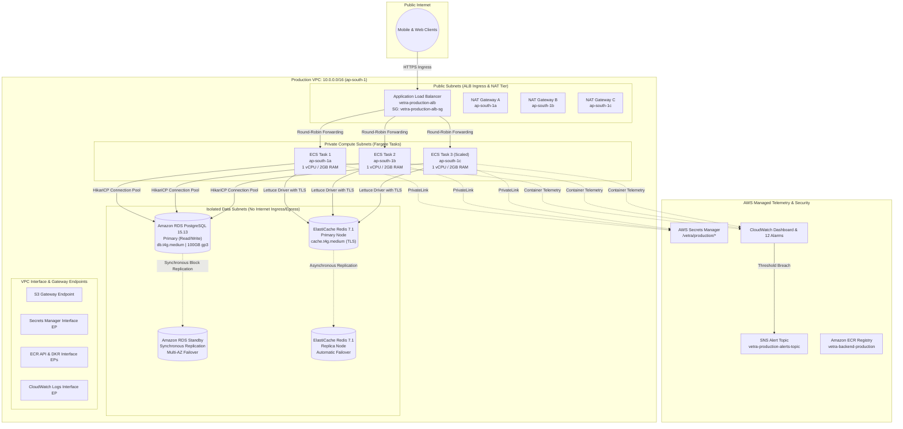

# Stage 14.12 — Production Infrastructure & High-Availability Manual

**Document ID:** OPS-14.12  
**Environment:** Production (`ap-south-1`)  
**Applies To:** AWS VPC (3-AZ), AWS ECS Fargate, AWS RDS Multi-AZ, AWS ElastiCache Cluster, AWS ALB, CloudWatch Observability  
**Status:** Architecture Implemented / Apply Pending Review  
**Last Updated:** August 2026  

---

## 1. Executive Summary & Overview

Stage 14.12 defines the **Production-Grade Cloud Infrastructure Specification** for the Vetra platform on AWS in region `ap-south-1` (Mumbai). Built upon the verified architectural foundations of Staging (Stages 14.1–14.11), the production environment implements strict **High Availability (HA)**, **Multi-AZ fault tolerance**, **elastic auto-scaling**, and **automated observability** designed for enterprise SLAs (99.9% uptime).



---

## 2. Staging vs. Production Specification Comparison

The production environment implements dedicated high-availability safeguards distinct from the cost-optimized staging configuration:

| Architectural Tier | Staging (`infra/environments/staging`) | Production (`infra/environments/production`) | Production High-Availability Rationale |
|---|---|---|---|
| **VPC CIDR** | `10.1.0.0/16` (2 AZs) | `10.0.0.0/16` (3 AZs: `a`, `b`, `c`) | Eliminates single-AZ dependency across all tiers. |
| **NAT Gateways** | 1 Shared NAT Gateway (`single_nat_gateway = true`) | 3 Dedicated NAT Gateways (`single_nat_gateway = false`, 1 per AZ) | Prevents cross-AZ failure from disrupting outbound API traffic. |
| **ECS Compute Sizing** | 0.5 vCPU / 1 GB RAM | 1.0 vCPU / 2 GB RAM (`cpu = 1024`, `memory = 2048`) | Provides enterprise heap headroom for concurrent JVM clinical operations. |
| **ECS Task Placement** | 1 Task (`desired_count = 1`, min: 1, max: 3) | 2 Baseline Tasks (`desired_count = 2`, min: 2, max: 10) | Ensures zero-downtime rolling deploys and instant AZ failover. |
| **Container Insights** | Disabled | Enabled (`containerInsights = enabled`) | Real-time task-level CPU, memory, network, and disk I/O metrics. |
| **RDS PostgreSQL Tier** | `db.t4g.micro`, 20 GB gp3, Single-AZ | `db.t4g.medium`, 100 GB gp3, Multi-AZ (`multi_az = true`) | Synchronous standby failover with 60-second recovery SLA. |
| **RDS Backup Policy** | 1 day retention, `skip_final_snapshot = true` | 7 days retention, `skip_final_snapshot = false` | Compliance-grade point-in-time recovery and snapshot protection. |
| **ElastiCache Redis Tier**| `cache.t4g.micro`, 1 node (No failover) | `cache.t4g.medium`, 2 nodes (`automatic_failover_enabled = true`) | Sub-minute automatic primary node failover with TLS. |
| **ECR Image Retention** | 3 days untagged, 10 tagged images | 7 days untagged, 30 tagged images | Extended rollback capacity for release stability. |
| **VPC Flow Logs** | 14 days retention | 30 days retention | Security audit and compliance requirement. |

---

## 3. High Availability & Resilience Specifications

### 3.1. Network Multi-AZ Architecture
- **Availability Zones:** `ap-south-1a`, `ap-south-1b`, `ap-south-1c`.
- **Subnet Allocation:**
  - Public Subnets (ALB & NAT): `10.0.1.0/24`, `10.0.2.0/24`, `10.0.3.0/24`
  - Private Subnets (ECS Compute): `10.0.10.0/24`, `10.0.11.0/24`, `10.0.12.0/24`
  - Isolated Subnets (RDS & Redis): `10.0.20.0/24`, `10.0.21.0/24`, `10.0.22.0/24`

### 3.2. Application Auto-Scaling Policies
- **Scalable Target:** `service/vetra-production-cluster/vetra-production-backend-service`
- **Capacity Limits:** Minimum `2` tasks, Maximum `10` tasks.
- **Dual Target-Tracking Policies:**
  1. **CPU Target Tracking:** Automatically maintains cluster average CPU at `70.0%` (Scale-out: 60s cooldown, Scale-in: 300s cooldown).
  2. **ALB Request Count Tracking:** Automatically scales when requests per target exceed `1000 req/target/min` (Scale-out: 60s cooldown, Scale-in: 300s cooldown).

### 3.3. Zero-Plaintext Secret Architecture
All database, cache, and signing credentials are automatically generated via high-entropy `random_password` resources and injected dynamically at container startup via AWS Secrets Manager:
- `/vetra/production/db/password` $\rightarrow$ Injected into `DB_PASSWORD` & `SPRING_DATASOURCE_PASSWORD`
- `/vetra/production/redis/password` $\rightarrow$ Injected into `REDIS_PASSWORD`
- `/vetra/production/jwt/secret` $\rightarrow$ Injected into `JWT_SECRET`

---

## 4. Production CloudWatch Observability Suite

The production monitoring module provisions a comprehensive telemetry suite:

| Alarm Identifier | Monitored Metric | Evaluation Period | Threshold | Severity |
|---|---|---|---|---|
| `vetra-production-ecs-cpu-high` | `AWS/ECS CPUUtilization` | 2 × 60s | $\ge 80\%$ | HIGH |
| `vetra-production-ecs-memory-high` | `AWS/ECS MemoryUtilization` | 2 × 60s | $\ge 80\%$ | HIGH |
| `vetra-production-alb-target-5xx-high` | `AWS/ApplicationELB HTTPCode_Target_5XX_Count` | 1 × 60s | $\ge 5$ errors | CRITICAL |
| `vetra-production-alb-latency-high` | `AWS/ApplicationELB TargetResponseTime (p95)` | 2 × 60s | $\ge 1.0\text{ s}$ | WARNING |
| `vetra-production-alb-unhealthy-hosts` | `AWS/ApplicationELB UnHealthyHostCount` | 2 × 60s | $\ge 1\text{ host}$ | CRITICAL |
| `vetra-production-rds-cpu-high` | `AWS/RDS CPUUtilization` | 2 × 300s | $\ge 80\%$ | HIGH |
| `vetra-production-rds-storage-low` | `AWS/RDS FreeStorageSpace` | 1 × 300s | $\le 10\text{ GB}$ | CRITICAL |
| `vetra-production-rds-connections-high` | `AWS/RDS DatabaseConnections` | 2 × 300s | $\ge 80$ conns | WARNING |
| `vetra-production-redis-engine-cpu-high`| `AWS/ElastiCache EngineCPUUtilization` | 2 × 60s | $\ge 75\%$ | HIGH |
| `vetra-production-redis-memory-high` | `AWS/ElastiCache DatabaseMemoryUsagePercentage` | 2 × 60s | $\ge 80\%$ | HIGH |
| `vetra-production-redis-evictions` | `AWS/ElastiCache Evictions` | 1 × 60s | $\ge 1$ key | WARNING |
| `vetra-production-app-error-spikes` | Log Metric Filter (`[ERROR]`) | 1 × 60s | $\ge 10$ errors | HIGH |
| `vetra-production-app-db-timeouts` | Log Metric Filter (`Connection timeout`) | 1 × 60s | $\ge 1$ timeout | CRITICAL |

---

## 5. Prerequisites & Open Decision Register

Before executing `terraform apply` for production, the following decisions must be formally approved:

| # | Item | Status | Description & Recommendation |
|---|---|---|---|
| **1** | **Production Custom Domain** | *Open Decision* | Target canonical domain name (e.g. `api.vetra.app` vs `prod.vetra.dpdns.org`). |
| **2** | **ACM Certificate ARN** | *Prerequisite* | Request & validate ACM certificate in `ap-south-1` for the production domain, then supply ARN to `certificate_arn`. |
| **3** | **DNS Delegation / Records** | *Open Decision* | Configure Route 53 ALIAS record or DNS CNAME pointing to the production ALB DNS. |
| **4** | **SNS Alert Email Subscribers** | *Open Decision* | Supply team on-call email / PagerDuty integration to `var.alert_email` for `vetra-production-alerts-topic`. |
| **5** | **Git Release / Promotion Branch** | *Open Decision* | Production IAM OIDC deploy role is scoped to `refs/heads/production`. Confirm Git branching strategy for release tags vs production branch. |
| **6** | **State Backend Bucket Provisioning** | *Prerequisite* | Create `vetra-terraform-state-ACCOUNT_ID` S3 bucket and `vetra-terraform-locks` DynamoDB table if not already created. |

---

## 6. Release Promotion & Rollback Runbook

### 6.1. Image Promotion to Production
1. Staging deployment passes all automated smoke tests on commit `SHA`.
2. Create a release tag or merge staging commit to `production` branch.
3. GitHub Actions assumes `vetra-production-github-actions-deploy` via OIDC.
4. Pushes tagged image `vetra-backend-production:SHA` to production ECR.
5. Updates production ECS task definition and triggers rolling update.

### 6.2. Emergency Rollback
```bash
# Instantly roll back production service to previous task definition revision
aws ecs update-service \
  --cluster vetra-production-cluster \
  --service vetra-production-backend-service \
  --task-definition vetra-production-backend:<PREVIOUS_STABLE_REVISION> \
  --region ap-south-1
```
